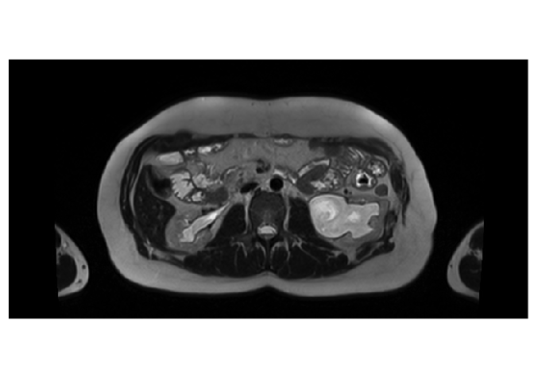

Check MR Images
================
11/12/2020

## Image data [2.2.11](https://livebook.manning.com/book/deep-learning-with-r/chapter-2/48)

Images typically have three dimensions:

    height × width × color channels

Although grayscale images have only a single color channel and could
thus be stored in 2D tensors, by convention image tensors are always 3D,
with a one-dimensional color channel for grayscale images.

A batch of 80 grayscale images of size 768×384 could thus be stored in a
tensor of shape

    (80, 768, 384, 1)

and a batch of 80 color images could be stored in a tensor of shape

    (80, 768, 384, 3)

*NOTE:* 768/2^7=6, 384/2^7=3.

*NOTE:* ANTsRNet::resampleTensorLike, ANTsRNet::resampleTensor,
keras::array\_reshape, reticulate::array\_reshape

*TODO 1*: Convert to function: images\_path

*TODO 2*: Extract from paths: image\_id, kind -&gt; SCAT, VSAT, …

## Check provided image data

``` r
paths <- fs::dir_ls(
  path = "../80_images",
  regexp = ".*\\.dcm$",
  recurse = TRUE
) %>% 
  as.character()
```

There should be 80\*4=320 images.

``` r
testthat::expect_equal(length(paths), 80 * 4)
```

``` r
iList <- imageFileNames2ImageList(paths)
n_images <- length(iList)
  
domainImage <- iList[[1]]
domainImage
#> antsImage
#>   Pixel Type          : float 
#>   Components Per Pixel: 3 
#>   Dimensions          : 836x496x1 
#>   Voxel Spacing       : 1x1x1 
#>   Origin              : 0 0 0 
#>   Direction           : 1 0 0 0 1 0 0 0 1 
#>   Filename           : ../80_images/1018642/dicom_blue/1.2.840.19104.20483.007.401004.1.637400293265047254.dcm
```

## All images must have the same attributes

``` r
pixeltype(domainImage)
#> [1] "float"
components(domainImage)
#> [1] 3
dim(domainImage)
#> [1] 836 496   1
spacing(domainImage)
#> [1] 1 1 1
origin(domainImage)
#> [1] 0 0 0
direction(domainImage)
#>      [,1] [,2] [,3]
#> [1,]    1    0    0
#> [2,]    0    1    0
#> [3,]    0    0    1
```

``` r
pixel_types <- purrr::map_chr(iList, pixeltype)
expected_types <- rep("float", n_images)
testthat::expect_identical(pixel_types, expected_types)
```

``` r
components_per_pixel <- purrr::map_dbl(iList, components)
expected_components_per_pixel <- rep(3, n_images)
testthat::expect_identical(components_per_pixel, expected_components_per_pixel)
```

Images have different y-dimensions: 494 495 496.

``` r
dims <- purrr::map(iList, dim)
x <- purrr::map_int(dims, dplyr::nth, 1)
y <- purrr::map_int(dims, dplyr::nth, 2)
z <- purrr::map_int(dims, dplyr::nth, 3)

expected_dims <- rep(list(dim(domainImage)), n_images)
expected_x <- purrr::map_int(expected_dims, dplyr::nth, 1)
expected_y <- purrr::map_int(expected_dims, dplyr::nth, 2)
expected_z <- purrr::map_int(expected_dims, dplyr::nth, 3)

testthat::expect_equal(x, expected_x)
# testthat::expect_equal(y, expected_y)
sort(unique(y))
#> [1] 494 495 496
testthat::expect_equal(z, expected_z)
```

``` r
spacings <- purrr::map(iList, spacing)
expected_spacings <- rep(list(spacing(domainImage)), n_images)
testthat::expect_identical(spacings, expected_spacings)
```

``` r
origins <- purrr::map(iList, origin)
expected_origins <- rep(list(origin(domainImage)), n_images)
testthat::expect_identical(origins, expected_origins)
```

``` r
directions <- purrr::map(iList, direction)
expected_directions <- rep(list(direction(domainImage)), n_images)
testthat::expect_identical(directions, expected_directions)
```

## TODO: dimensions 836×496×1 -&gt; 768×384

NOTE: `ANTsRCore::cropIndices` does not work on multichannel images.

``` r
crop_image_768x384 <- function(img) {
  ll = c(34, 56)
  ur = ll + c(768 - 1, 384 - 1)
  ANTsRCore::cropIndices(img, ll, ur)
}
```

BUG: `antsImageWrite(slice, "x.nii.gz")` – this crashes RStudio Session.

``` r
(p <- paths[[120]])
#> [1] "../80_images/554667-2014/image_base/1.2.840.19104.20483.007.1201.1.637398377875179013.dcm"
img <- ANTsRCore::antsImageRead(p)
channels <- ANTsRCore::splitChannels(img)

slice <- ANTsRCore::extractSlice(channels[[1]], 1, 3)
dim(slice)
#> [1] 836 495
slice2 <- crop_image_768x384(slice)
dim(slice2)
#> [1] 768 384
arr <- as.array(slice2)

plot_array2d(arr)
```



``` r
# invisible(plot(slice2))
```

## TODO: set dimnames on X\_train tensor / array

``` r
ar <- array(1:24, dim = c(2, 3, 4))
dimnames(ar)[[1]] <- c("A", "B")
ar["A",,] == ar[1,,]
#>      [,1] [,2] [,3] [,4]
#> [1,] TRUE TRUE TRUE TRUE
#> [2,] TRUE TRUE TRUE TRUE
#> [3,] TRUE TRUE TRUE TRUE
ar["B",,] == ar[2,,]
#>      [,1] [,2] [,3] [,4]
#> [1,] TRUE TRUE TRUE TRUE
#> [2,] TRUE TRUE TRUE TRUE
#> [3,] TRUE TRUE TRUE TRUE
```
