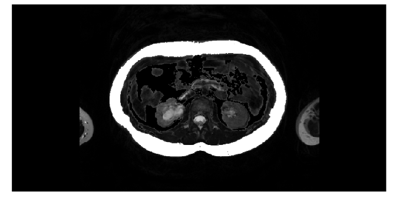
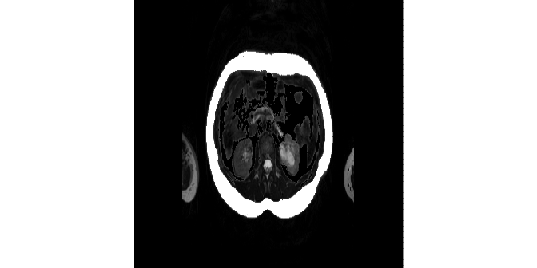

Convert Images to Tensors
================
17.11.2020

*NOTE:* Use these functions `ANTsRNet::resampleTensor`,
`reticulate::array_reshape`

## Image data for U-Net

Source [2.2.11 Data representations for neural
networks](https://livebook.manning.com/book/deep-learning-with-r/chapter-2/48)
in [Deep Learning with
R](https://www.manning.com/books/deep-learning-with-r) by François
Chollet with J. J. Allaire.

Images typically have three dimensions:

    height × width × color channels

Although grayscale images have only a single color channel and could
thus be stored in 2D tensors, by convention image tensors are always 3D,
with a one-dimensional color channel for grayscale images.

A batch of 80 grayscale images of size 768×384 could thus be stored in a
tensor of shape

    (80, 768, 384, 1)

and a batch of 80 color images could be stored in a tensor of shape

    (80, 768, 384, 3)

and a batch of 80 mask –

    (80, 768, 384, 2)

## Important Note

We will crop all images to 768x384 and prepare additional data with
resampled (smaller) images: 384x192 and 192x96. Note that both
dimensions 768x384 are divisble by 128 (768/2^7=6, 384/2^7=3).

## Read Images Info

``` r
info <- images_info("../80_images", extension = "dcm") %>% 
  dplyr::slice(1:8)
info
#> # A tibble: 8 x 5
#>   patient kind  type      series    file_path                                   
#>   <chr>   <chr> <chr>     <chr>     <chr>                                       
#> 1 1018642 AT    dicom_co… ../80_im… ../80_images/1018642/dicom_color/1.2.840.19…
#> 2 1018642 MRI   image_ba… ../80_im… ../80_images/1018642/image_base/1.2.840.191…
#> 3 1018642 SCAT  dicom_red ../80_im… ../80_images/1018642/dicom_red/1.2.840.1910…
#> 4 1018642 VSAT  dicom_bl… ../80_im… ../80_images/1018642/dicom_blue/1.2.840.191…
#> 5 1023660 AT    dicom_co… ../80_im… ../80_images/1023660/dicom_color/1.2.840.19…
#> 6 1023660 MRI   image_ba… ../80_im… ../80_images/1023660/image_base/1.2.840.191…
#> 7 1023660 SCAT  dicom_red ../80_im… ../80_images/1023660/dicom_red/1.2.840.1910…
#> 8 1023660 VSAT  dicom_bl… ../80_im… ../80_images/1023660/dicom_blue/1.2.840.191…
```

``` r
crop_image_wxhx1 <- function(img, ll = c(34, 56), wh = c(768, 384)) {
  ll = c(ll, 1)                        # c(34, 56, 1)
  ur = ll + c(wh, 0) - c(1, 1, 0)      # c(768 - 1, 384 - 1, 0)
  ANTsRCore::cropIndices(img, ll, ur)
}

crop_image_wxh <- function(img, ll = c(34, 56), wh = c(768, 384)) {
  ur = ll + wh - c(1, 1)               # c(768 - 1, 384 - 1)
  ANTsRCore::cropIndices(img, ll, ur)
}
```

## Base images

``` r
base_paths <- info %>% filter(kind == "MRI")
iList <- imageFileNames2ImageList(base_paths[["file_path"]])
n_images <- length(iList)

Y_train <- array(
  data = NA, 
  dim = c(3, 768, 384, n_images)
)
```

``` r
p <- info$file_path[[1]]
img <- ANTsRCore::antsImageRead(p)
channels <- ANTsRCore::splitChannels(img)
slice <- ANTsRCore::extractSlice(channels[[1]], 1, 3)
cslice <- crop_image_wxh(slice)
aslice = as.array(cslice)

dim(cslice)
#> [1] 768 384
dim(aslice)
#> [1] 768 384
```

``` r
plot_array2d(aslice)
invisible(plot(cslice, doCropping=F))
```



``` r
K <- keras::backend()
array_crop <- purrr::compose(as.array, crop_image_wxhx1)
aList <- map(iList, array_crop)
str(aList)
#> List of 2
#>  $ : num [1:3, 1:768, 1:384, 1] 0 0 0 0 0 0 0 0 0 0 ...
#>  $ : num [1:3, 1:768, 1:384, 1] 0 0 0 0 0 0 0 0 0 0 ...
seq_along(aList)
#> [1] 1 2

for (i in seq_along(aList)) {
  Y_train[,,,i] <- aList[[i]]
}
Y_train <- as.array(
  K$permute_dimensions(Y_train, pattern = c(3L, 1L, 2L, 0L))
)

str(Y_train)
#>  num [1:2, 1:768, 1:384, 1:3] 0 0 0 0 0 0 0 0 0 0 ...

dimnames(Y_train)[[1]] <- base_paths$patient
dimnames(Y_train)[[1]]
#> [1] "1018642" "1023660"
```

``` r
dim(Y_train)
#> [1]   2 768 384   3
dimnames(Y_train)[[1]]
#> [1] "1018642" "1023660"
dim(Y_train[2,,,1])
#> [1] 768 384
dim(Y_train["1023660",,,1])
#> [1] 768 384
```

``` r
plot_array2d(Y_train[2,,,1])
plot_array2d(Y_train["1023660",,,1])
```


