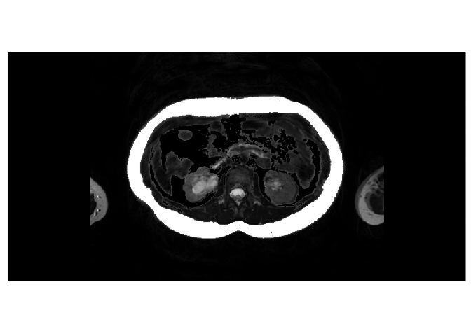
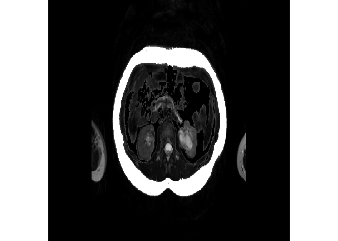
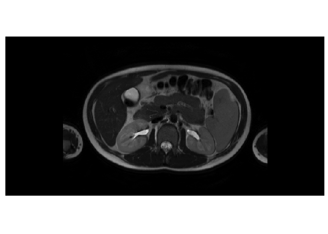
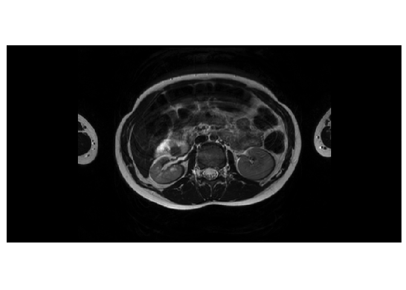

Convert Images to Tensors
================
15.11.2020

*NOTE:* ANTsRNet::resampleTensorLike, ANTsRNet::resampleTensor,
keras::array\_reshape, reticulate::array\_reshape

## Image data for U-Net [2.2.11](https://livebook.manning.com/book/deep-learning-with-r/chapter-2/48)

Images typically have three dimensions:

    height × width × color channels

Although grayscale images have only a single color channel and could
thus be stored in 2D tensors, by convention image tensors are always 3D,
with a one-dimensional color channel for grayscale images.

A batch of 80 grayscale images of size 768×384 could thus be stored in a
tensor of shape

    (80, 768, 384, 1)

and a batch of 80 color images could be stored in a tensor of shape

    (80, 768, 384, 3)

*NOTE:* 768/2^7=6, 384/2^7=3.

## Read file names of images

``` r
info <- images_info("../80_images", extension = "dcm") %>% 
  dplyr::slice(1:16)
info
#> # A tibble: 16 x 5
#>    patient kind       image    series    file_name                              
#>    <chr>   <chr>      <chr>    <chr>     <chr>                                  
#>  1 1018642 base       image_b… ../80_im… ../80_images/1018642/image_base/1.2.84…
#>  2 1018642 fat        dicom_c… ../80_im… ../80_images/1018642/dicom_color/1.2.8…
#>  3 1018642 subcutane… dicom_r… ../80_im… ../80_images/1018642/dicom_red/1.2.840…
#>  4 1018642 visceral_… dicom_b… ../80_im… ../80_images/1018642/dicom_blue/1.2.84…
#>  5 1023660 base       image_b… ../80_im… ../80_images/1023660/image_base/1.2.84…
#>  6 1023660 fat        dicom_c… ../80_im… ../80_images/1023660/dicom_color/1.2.8…
#>  7 1023660 subcutane… dicom_r… ../80_im… ../80_images/1023660/dicom_red/1.2.840…
#>  8 1023660 visceral_… dicom_b… ../80_im… ../80_images/1023660/dicom_blue/1.2.84…
#>  9 1040979 base       image_b… ../80_im… ../80_images/1040979/image_base/1.2.84…
#> 10 1040979 fat        dicom_c… ../80_im… ../80_images/1040979/dicom_color/1.2.8…
#> 11 1040979 subcutane… dicom_r… ../80_im… ../80_images/1040979/dicom_red/1.2.840…
#> 12 1040979 visceral_… dicom_b… ../80_im… ../80_images/1040979/dicom_blue/1.2.84…
#> 13 1041204 base       image_b… ../80_im… ../80_images/1041204/image_base/1.2.84…
#> 14 1041204 fat        dicom_c… ../80_im… ../80_images/1041204/dicom_color/1.2.8…
#> 15 1041204 subcutane… dicom_r… ../80_im… ../80_images/1041204/dicom_red/1.2.840…
#> 16 1041204 visceral_… dicom_b… ../80_im… ../80_images/1041204/dicom_blue/1.2.84…
```

``` r
crop_image_768x384x1 <- function(img) {
  ll = c(34, 56, 1)
  ur = ll + c(768 - 1, 384 - 1, 0)
  ANTsRCore::cropIndices(img, ll, ur)
}

crop_image_768x384 <- function(img) {
  ll = c(34, 56)
  ur = ll + c(768 - 1, 384 - 1)
  ANTsRCore::cropIndices(img, ll, ur)
}
```

## Base images

``` r
base_paths <- info %>% filter(kind == "base")
iList <- imageFileNames2ImageList(base_paths[["file_name"]])
n_images <- length(iList)

Y_train <- array(
  data = NA, 
  dim = c(3, 768, 384, n_images)
)
```

``` r
p <- info$file_name[[1]]
img <- ANTsRCore::antsImageRead(p)
channels <- ANTsRCore::splitChannels(img)
slice <- ANTsRCore::extractSlice(channels[[1]], 1, 3)
cslice <- crop_image_768x384(slice)
aslice = as.array(cslice)

plot_array2d(aslice)
```



``` r
invisible(plot(cslice, doCropping=F))
```



``` r
K <- keras::backend()
array_crop <- purrr::compose(as.array, crop_image_768x384x1)
aList <- map(iList, array_crop)

for (i in seq_along(aList)) {
  Y_train[,,,i] <- aList[[i]]
}
Y_train <- as.array(
  K$permute_dimensions(Y_train, pattern = c(3L, 1L, 2L, 0L))
)

dimnames(Y_train)[[1]] <- base_paths$patient
```

``` r
dim(Y_train)
#> [1]   4 768 384   3
dimnames(Y_train)[[1]]
#> [1] "1018642" "1023660" "1040979" "1041204"
dim(Y_train[3,,,1])
#> [1] 768 384
dim(Y_train["1040979",,,1])
#> [1] 768 384
```

``` r
for(name in dimnames(Y_train)[[1]]) {
  cat(name, "\n")
}
#> 1018642 
#> 1023660 
#> 1040979 
#> 1041204
```

``` r
plot_array2d(Y_train[3,,,1])
```



``` r
plot_array2d(Y_train["1040979",,,1])
```


