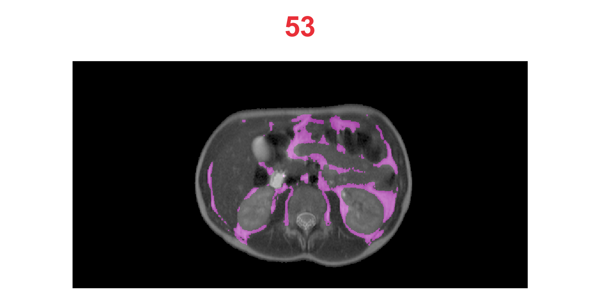
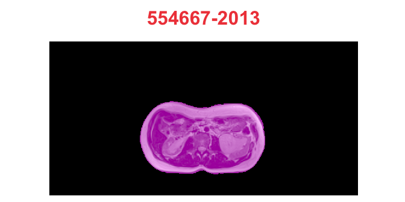
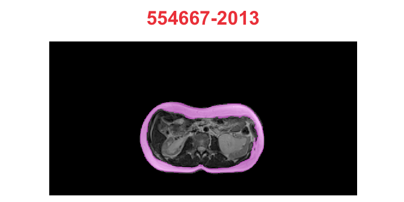
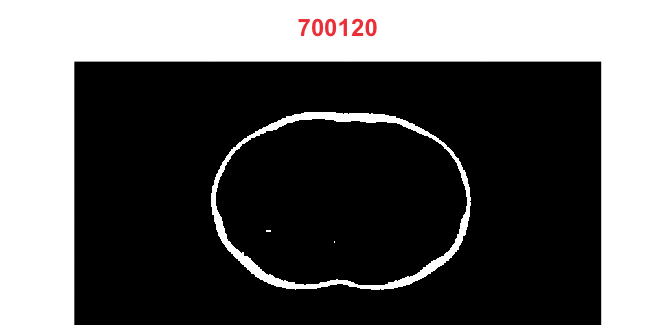

## Image data for U-Net

Source [2.2.11 Data representations for neural networks](https://livebook.manning.com/book/deep-learning-with-r/chapter-2/48)
in [Deep Learning with R](https://www.manning.com/books/deep-learning-with-r)
by François Chollet with J. J. Allaire.

Images typically have three dimensions:
```
height × width × color channels
```
Although grayscale images have only a single color channel
and could thus be stored in 2D tensors, by convention
image tensors are always 3D, with a one-dimensional color channel
for grayscale images.

A batch of 80 grayscale images of size 768×384 could thus
be stored in a tensor of shape
```
(80, 768, 384, 1)
```
and a batch of 80 color images could be stored in a tensor of shape
```
(80, 768, 384, 3)
```
and a batch of 80 mask --
```
(80, 768, 384, 2)
```


## Important Note

We will crop all images to the 768x384 size and 
prepare tensors for U-Net NN in dimensions:
```
768x384, 384x192 and 192x96
```

Note that both dimensions 768x384 are divisble by 128
(768/2^7=6, 384/2^7=3).


## Helper functions


```r
crop_image_wxhx1 <- function(img, ll = c(34, 56), wh = c(768, 384)) {
  ll = c(ll, 1)
  ur = ll + c(wh, 0) - c(1, 1, 0)
  ANTsRCore::cropIndices(img, ll, ur)
}

get_channel <- function(img, channel = 1) {
  ANTsRCore::splitChannels(img)[[channel]]
}

imageList2sliceList <- function(
    iList,
    channel = 1,
    z_slice = 1,
    do_cropping = TRUE,
    lower_left = c(34, 56),
    width_x_height = c(768, 384)
) {
  if (do_cropping == TRUE) {
    iList <- purrr::map(
      iList,
      crop_image_wxhx1, ll = lower_left, wh = width_x_height
    )
  }
  iList <- purrr::map(iList, get_channel, ch = channel)
  iList <- purrr::map(iList,
    ANTsRCore::extractSlice, slice = z_slice, direction = 3
  )
}

imageList2MaskList <- function(iList, clean_up = 2) {
  purrr::map(iList, ANTsRCore::getMask, cleanup = clean_up)
}

imageList2arrayList <- function(iList) {
  purrr::map(iList, as.array)
}

arrayList2Tensor <- function(aList, dim_names = info_mri$patient) {
  tensor <- array(
    data = NA,
    dim = c(length(aList), dim(aList[[1]]))
  )

  for (i in seq_along(aList)) {
    tensor[i,,] <- aList[[i]]
  }
  dimnames(tensor)[[1]] <- dim_names

  tensor
}
```


## Read Images Info


```r
info <- images_info("../80_images", extension = "dcm")
```


```r
info_mri <- info %>% filter(kind == "MRI")
info_mri
```

<div data-pagedtable="false">
  <script data-pagedtable-source type="application/json">
{"columns":[{"label":["patient"],"name":[1],"type":["chr"],"align":["left"]},{"label":["kind"],"name":[2],"type":["chr"],"align":["left"]},{"label":["type"],"name":[3],"type":["chr"],"align":["left"]},{"label":["series"],"name":[4],"type":["chr"],"align":["left"]},{"label":["file_path"],"name":[5],"type":["chr"],"align":["left"]}],"data":[{"1":"1018642","2":"MRI","3":"image_base","4":"../80_images","5":"../80_images/1018642/image_base/1.2.840.19104.20483.007.401003.1.637400293207251365.dcm"},{"1":"1023660","2":"MRI","3":"image_base","4":"../80_images","5":"../80_images/1023660/image_base/1.2.840.19104.20483.007.1001003.1.637400294155534988.dcm"},{"1":"1040979","2":"MRI","3":"image_base","4":"../80_images","5":"../80_images/1040979/image_base/1.2.840.19104.20483.007.901003.1.637400296387505978.dcm"},{"1":"1041204","2":"MRI","3":"image_base","4":"../80_images","5":"../80_images/1041204/image_base/1.2.840.19104.20483.007.801003.1.637400297345061769.dcm"},{"1":"1095912","2":"MRI","3":"image_base","4":"../80_images","5":"../80_images/1095912/image_base/1.2.840.19104.20483.007.801003.1.637400298323931916.dcm"},{"1":"1110505-2011","2":"MRI","3":"image_base","4":"../80_images","5":"../80_images/1110505-2011/image_base/1.2.840.19104.20483.007.801003.1.637400299629371754.dcm"},{"1":"1110505-2012","2":"MRI","3":"image_base","4":"../80_images","5":"../80_images/1110505-2012/image_base/1.2.840.19104.20483.007.1201.1.637400301058502819.dcm"},{"1":"1176610","2":"MRI","3":"image_base","4":"../80_images","5":"../80_images/1176610/image_base/1.2.840.19104.20483.007.1201.1.637400306678751778.dcm"},{"1":"1185364","2":"MRI","3":"image_base","4":"../80_images","5":"../80_images/1185364/image_base/1.2.840.19104.20483.007.901003.1.637400308427105779.dcm"},{"1":"158894-2016","2":"MRI","3":"image_base","4":"../80_images","5":"../80_images/158894-2016/image_base/1.2.840.19104.20483.007.401003.1.637398298826988548.dcm"},{"1":"158894-2018","2":"MRI","3":"image_base","4":"../80_images","5":"../80_images/158894-2018/image_base/1.2.840.19104.20483.007.401003.1.637398301501090302.dcm"},{"1":"163855","2":"MRI","3":"image_base","4":"../80_images","5":"../80_images/163855/image_base/1.2.840.19104.20483.007.801003.1.637398303611004495.dcm"},{"1":"197929-2015","2":"MRI","3":"image_base","4":"../80_images","5":"../80_images/197929-2015/image_base/1.2.840.19104.20483.007.501003.1.637398310676287684.dcm"},{"1":"254582-2014","2":"MRI","3":"image_base","4":"../80_images","5":"../80_images/254582-2014/image_base/1.2.840.19104.20483.007.1201.1.637398312414769117.dcm"},{"1":"254582-2016","2":"MRI","3":"image_base","4":"../80_images","5":"../80_images/254582-2016/image_base/1.2.840.19104.20483.007.1201.1.637398314027870176.dcm"},{"1":"281774-2018","2":"MRI","3":"image_base","4":"../80_images","5":"../80_images/281774-2018/image_base/1.2.840.19104.20483.007.1201.1.637398319505480573.dcm"},{"1":"306001","2":"MRI","3":"image_base","4":"../80_images","5":"../80_images/306001/image_base/1.2.840.19104.20483.007.701003.1.637398322417875361.dcm"},{"1":"306637","2":"MRI","3":"image_base","4":"../80_images","5":"../80_images/306637/image_base/1.2.840.19104.20483.007.401003.1.637398323894039159.dcm"},{"1":"307629","2":"MRI","3":"image_base","4":"../80_images","5":"../80_images/307629/image_base/1.2.840.19104.20483.007.401003.1.637398325121769785.dcm"},{"1":"330238","2":"MRI","3":"image_base","4":"../80_images","5":"../80_images/330238/image_base/1.2.840.19104.20483.007.801003.1.637398326837457092.dcm"},{"1":"376426","2":"MRI","3":"image_base","4":"../80_images","5":"../80_images/376426/image_base/1.2.840.19104.20483.007.501003.1.637398335573999081.dcm"},{"1":"377549","2":"MRI","3":"image_base","4":"../80_images","5":"../80_images/377549/image_base/1.2.840.19104.20483.007.901003.1.637398338067961527.dcm"},{"1":"387800","2":"MRI","3":"image_base","4":"../80_images","5":"../80_images/387800/image_base/1.2.840.19104.20483.007.201003.1.637398339773463663.dcm"},{"1":"389728","2":"MRI","3":"image_base","4":"../80_images","5":"../80_images/389728/image_base/1.2.840.19104.20483.007.401003.1.637398341440138862.dcm"},{"1":"400295","2":"MRI","3":"image_base","4":"../80_images","5":"../80_images/400295/image_base/1.2.840.19104.20483.007.401003.1.637398344601146516.dcm"},{"1":"415676","2":"MRI","3":"image_base","4":"../80_images","5":"../80_images/415676/image_base/1.2.840.19104.20483.007.401003.1.637398350565100134.dcm"},{"1":"547766","2":"MRI","3":"image_base","4":"../80_images","5":"../80_images/547766/image_base/1.2.840.19104.20483.007.1201.1.637398351683574721.dcm"},{"1":"552705","2":"MRI","3":"image_base","4":"../80_images","5":"../80_images/552705/image_base/1.2.840.19104.20483.007.301003.1.637398352826543141.dcm"},{"1":"554667-2013","2":"MRI","3":"image_base","4":"../80_images","5":"../80_images/554667-2013/image_base/1.2.840.19104.20483.007.1202.1.637398354399227341.dcm"},{"1":"554667-2014","2":"MRI","3":"image_base","4":"../80_images","5":"../80_images/554667-2014/image_base/1.2.840.19104.20483.007.1201.1.637398377875179013.dcm"},{"1":"578317","2":"MRI","3":"image_base","4":"../80_images","5":"../80_images/578317/image_base/1.2.840.19104.20483.007.1201.1.637398379184082530.dcm"},{"1":"579124","2":"MRI","3":"image_base","4":"../80_images","5":"../80_images/579124/image_base/1.2.840.19104.20483.007.601003.1.637398380540351965.dcm"},{"1":"600725-2013","2":"MRI","3":"image_base","4":"../80_images","5":"../80_images/600725-2013/image_base/1.2.840.19104.20483.007.1201.1.637398387421023271.dcm"},{"1":"600725-2019","2":"MRI","3":"image_base","4":"../80_images","5":"../80_images/600725-2019/image_base/1.2.840.19104.20483.007.1001004.1.637398402096578032.dcm"},{"1":"626604","2":"MRI","3":"image_base","4":"../80_images","5":"../80_images/626604/image_base/1.2.840.19104.20483.007.1201.1.637398403585790852.dcm"},{"1":"648995-2011","2":"MRI","3":"image_base","4":"../80_images","5":"../80_images/648995-2011/image_base/1.2.840.19104.20483.007.601003.1.637398404939804112.dcm"},{"1":"648995-2013","2":"MRI","3":"image_base","4":"../80_images","5":"../80_images/648995-2013/image_base/1.2.840.19104.20483.007.601003.1.637398405939030483.dcm"},{"1":"648995-2014","2":"MRI","3":"image_base","4":"../80_images","5":"../80_images/648995-2014/image_base/1.2.840.19104.20483.007.601003.1.637398406855503470.dcm"},{"1":"661579","2":"MRI","3":"image_base","4":"../80_images","5":"../80_images/661579/image_base/1.2.840.19104.20483.007.1201.1.637398408185301560.dcm"},{"1":"665924","2":"MRI","3":"image_base","4":"../80_images","5":"../80_images/665924/image_base/1.2.840.19104.20483.007.1201.1.637398422873385130.dcm"},{"1":"678810","2":"MRI","3":"image_base","4":"../80_images","5":"../80_images/678810/image_base/1.2.840.19104.20483.007.601003.1.637398423911230217.dcm"},{"1":"683412-2015","2":"MRI","3":"image_base","4":"../80_images","5":"../80_images/683412-2015/image_base/1.2.840.19104.20483.007.901003.1.637398425092292069.dcm"},{"1":"683412-2016","2":"MRI","3":"image_base","4":"../80_images","5":"../80_images/683412-2016/image_base/1.2.840.19104.20483.007.1201.1.637398426473571687.dcm"},{"1":"683412-2019","2":"MRI","3":"image_base","4":"../80_images","5":"../80_images/683412-2019/image_base/1.2.840.19104.20483.007.1201.1.637398427870877817.dcm"},{"1":"690256","2":"MRI","3":"image_base","4":"../80_images","5":"../80_images/690256/image_base/1.2.840.19104.20483.007.601003.1.637398437963700920.dcm"},{"1":"700120","2":"MRI","3":"image_base","4":"../80_images","5":"../80_images/700120/image_base/1.2.840.19104.20483.007.601003.1.637398439152388948.dcm"},{"1":"712846","2":"MRI","3":"image_base","4":"../80_images","5":"../80_images/712846/image_base/1.2.840.19104.20483.007.701003.1.637398444604079727.dcm"},{"1":"715432","2":"MRI","3":"image_base","4":"../80_images","5":"../80_images/715432/image_base/1.2.840.19104.20483.007.601003.1.637398446234051328.dcm"},{"1":"723887-2016","2":"MRI","3":"image_base","4":"../80_images","5":"../80_images/723887-2016/image_base/1.2.840.19104.20483.007.801003.1.637398448806278693.dcm"},{"1":"723887-2018","2":"MRI","3":"image_base","4":"../80_images","5":"../80_images/723887-2018/image_base/1.2.840.19104.20483.007.701003.1.637398450653480436.dcm"},{"1":"754337","2":"MRI","3":"image_base","4":"../80_images","5":"../80_images/754337/image_base/1.2.840.19104.20483.007.1201.1.637398453620750879.dcm"},{"1":"764045","2":"MRI","3":"image_base","4":"../80_images","5":"../80_images/764045/image_base/1.2.840.19104.20483.007.601003.1.637398465560263581.dcm"},{"1":"795905","2":"MRI","3":"image_base","4":"../80_images","5":"../80_images/795905/image_base/1.2.840.19104.20483.007.601003.1.637398466563898641.dcm"},{"1":"797208","2":"MRI","3":"image_base","4":"../80_images","5":"../80_images/797208/image_base/1.2.840.19104.20483.007.1201.1.637398475591179840.dcm"},{"1":"797610","2":"MRI","3":"image_base","4":"../80_images","5":"../80_images/797610/image_base/1.2.840.19104.20483.007.601003.1.637398477136345194.dcm"},{"1":"801802","2":"MRI","3":"image_base","4":"../80_images","5":"../80_images/801802/image_base/1.2.840.19104.20483.007.901003.1.637398478162902601.dcm"},{"1":"802551","2":"MRI","3":"image_base","4":"../80_images","5":"../80_images/802551/image_base/1.2.840.19104.20483.007.1201.1.637398481028300201.dcm"},{"1":"803817","2":"MRI","3":"image_base","4":"../80_images","5":"../80_images/803817/image_base/1.2.840.19104.20483.007.1201.1.637398483032858224.dcm"},{"1":"804568","2":"MRI","3":"image_base","4":"../80_images","5":"../80_images/804568/image_base/1.2.840.19104.20483.007.501003.1.637398484290798083.dcm"},{"1":"806365","2":"MRI","3":"image_base","4":"../80_images","5":"../80_images/806365/image_base/1.2.840.19104.20483.007.1201.1.637399389412120781.dcm"},{"1":"835693","2":"MRI","3":"image_base","4":"../80_images","5":"../80_images/835693/image_base/1.2.840.19104.20483.007.501003.1.637399390711423097.dcm"},{"1":"840780","2":"MRI","3":"image_base","4":"../80_images","5":"../80_images/840780/image_base/1.2.840.19104.20483.007.601003.1.637399395073083098.dcm"},{"1":"843037","2":"MRI","3":"image_base","4":"../80_images","5":"../80_images/843037/image_base/1.2.840.19104.20483.007.501003.1.637399396101400604.dcm"},{"1":"853661","2":"MRI","3":"image_base","4":"../80_images","5":"../80_images/853661/image_base/1.2.840.19104.20483.007.1301003.1.637399397603063006.dcm"},{"1":"854387","2":"MRI","3":"image_base","4":"../80_images","5":"../80_images/854387/image_base/1.2.840.19104.20483.007.501003.1.637399398634200733.dcm"},{"1":"858488","2":"MRI","3":"image_base","4":"../80_images","5":"../80_images/858488/image_base/1.2.840.19104.20483.007.1201.1.637399399657433017.dcm"},{"1":"871006","2":"MRI","3":"image_base","4":"../80_images","5":"../80_images/871006/image_base/1.2.840.19104.20483.007.1001003.1.637399402326032807.dcm"},{"1":"873863","2":"MRI","3":"image_base","4":"../80_images","5":"../80_images/873863/image_base/1.2.840.19104.20483.007.1201.1.637399420496442613.dcm"},{"1":"876730","2":"MRI","3":"image_base","4":"../80_images","5":"../80_images/876730/image_base/1.2.840.19104.20483.007.401003.1.637399421399654127.dcm"},{"1":"878740","2":"MRI","3":"image_base","4":"../80_images","5":"../80_images/878740/image_base/1.2.840.19104.20483.007.1201.1.637399425313552738.dcm"},{"1":"879820","2":"MRI","3":"image_base","4":"../80_images","5":"../80_images/879820/image_base/1.2.840.19104.20483.007.601003.1.637399440924539031.dcm"},{"1":"882360-2016","2":"MRI","3":"image_base","4":"../80_images","5":"../80_images/882360-2016/image_base/1.2.840.19104.20483.007.501003.1.637399455261711840.dcm"},{"1":"882360-2017","2":"MRI","3":"image_base","4":"../80_images","5":"../80_images/882360-2017/image_base/1.2.840.19104.20483.007.601003.1.637399456194021431.dcm"},{"1":"883616","2":"MRI","3":"image_base","4":"../80_images","5":"../80_images/883616/image_base/1.2.840.19104.20483.007.601003.1.637400284794884291.dcm"},{"1":"887603","2":"MRI","3":"image_base","4":"../80_images","5":"../80_images/887603/image_base/1.2.840.19104.20483.007.401003.1.637400285604663835.dcm"},{"1":"894688","2":"MRI","3":"image_base","4":"../80_images","5":"../80_images/894688/image_base/1.2.840.19104.20483.007.401003.1.637400286599521754.dcm"},{"1":"902756","2":"MRI","3":"image_base","4":"../80_images","5":"../80_images/902756/image_base/1.2.840.19104.20483.007.601003.1.637400287573062167.dcm"},{"1":"914522","2":"MRI","3":"image_base","4":"../80_images","5":"../80_images/914522/image_base/1.2.840.19104.20483.007.1201.1.637400289499873266.dcm"},{"1":"918538","2":"MRI","3":"image_base","4":"../80_images","5":"../80_images/918538/image_base/1.2.840.19104.20483.007.701003.1.637400290446851651.dcm"},{"1":"924243","2":"MRI","3":"image_base","4":"../80_images","5":"../80_images/924243/image_base/1.2.840.19104.20483.007.701003.1.637400291471687581.dcm"}],"options":{"columns":{"min":{},"max":[10]},"rows":{"min":[2],"max":[2]},"pages":{}}}
  </script>
</div>


```r
info_scat <- info %>% filter(kind == "SCAT")
info_scat
```

<div data-pagedtable="false">
  <script data-pagedtable-source type="application/json">
{"columns":[{"label":["patient"],"name":[1],"type":["chr"],"align":["left"]},{"label":["kind"],"name":[2],"type":["chr"],"align":["left"]},{"label":["type"],"name":[3],"type":["chr"],"align":["left"]},{"label":["series"],"name":[4],"type":["chr"],"align":["left"]},{"label":["file_path"],"name":[5],"type":["chr"],"align":["left"]}],"data":[{"1":"1018642","2":"SCAT","3":"dicom_red","4":"../80_images","5":"../80_images/1018642/dicom_red/1.2.840.19104.20483.007.401005.1.637400293305004952.dcm"},{"1":"1023660","2":"SCAT","3":"dicom_red","4":"../80_images","5":"../80_images/1023660/dicom_red/1.2.840.19104.20483.007.1001005.1.637400294250742084.dcm"},{"1":"1040979","2":"SCAT","3":"dicom_red","4":"../80_images","5":"../80_images/1040979/dicom_red/1.2.840.19104.20483.007.901005.1.637400296486041886.dcm"},{"1":"1041204","2":"SCAT","3":"dicom_red","4":"../80_images","5":"../80_images/1041204/dicom_red/1.2.840.19104.20483.007.801005.1.637400297461061572.dcm"},{"1":"1095912","2":"SCAT","3":"dicom_red","4":"../80_images","5":"../80_images/1095912/dicom_red/1.2.840.19104.20483.007.801005.1.637400298470321973.dcm"},{"1":"1110505-2011","2":"SCAT","3":"dicom_red","4":"../80_images","5":"../80_images/1110505-2011/dicom_red/1.2.840.19104.20483.007.801005.1.637400299722301842.dcm"},{"1":"1110505-2012","2":"SCAT","3":"dicom_red","4":"../80_images","5":"../80_images/1110505-2012/dicom_red/1.2.840.19104.20483.007.1203.1.637400301196431296.dcm"},{"1":"1176610","2":"SCAT","3":"dicom_red","4":"../80_images","5":"../80_images/1176610/dicom_red/1.2.840.19104.20483.007.1203.1.637400306810241404.dcm"},{"1":"1185364","2":"SCAT","3":"dicom_red","4":"../80_images","5":"../80_images/1185364/dicom_red/1.2.840.19104.20483.007.901005.1.637400308553515615.dcm"},{"1":"158894-2016","2":"SCAT","3":"dicom_red","4":"../80_images","5":"../80_images/158894-2016/dicom_red/1.2.840.19104.20483.007.401004.1.637398298977619198.dcm"},{"1":"158894-2018","2":"SCAT","3":"dicom_red","4":"../80_images","5":"../80_images/158894-2018/dicom_red/1.2.840.19104.20483.007.401005.1.637398301683848203.dcm"},{"1":"163855","2":"SCAT","3":"dicom_red","4":"../80_images","5":"../80_images/163855/dicom_red/1.2.840.19104.20483.007.801005.1.637398303795599411.dcm"},{"1":"197929-2015","2":"SCAT","3":"dicom_red","4":"../80_images","5":"../80_images/197929-2015/dicom_red/1.2.840.19104.20483.007.501005.1.637398310860177722.dcm"},{"1":"254582-2014","2":"SCAT","3":"dicom_red","4":"../80_images","5":"../80_images/254582-2014/dicom_red/1.2.840.19104.20483.007.1203.1.637398312678809351.dcm"},{"1":"254582-2016","2":"SCAT","3":"dicom_red","4":"../80_images","5":"../80_images/254582-2016/dicom_red/1.2.840.19104.20483.007.1203.1.637398314159297379.dcm"},{"1":"281774-2018","2":"SCAT","3":"dicom_red","4":"../80_images","5":"../80_images/281774-2018/dicom_red/1.2.840.19104.20483.007.1203.1.637398319638296859.dcm"},{"1":"306001","2":"SCAT","3":"dicom_red","4":"../80_images","5":"../80_images/306001/dicom_red/1.2.840.19104.20483.007.701005.1.637398322717861206.dcm"},{"1":"306637","2":"SCAT","3":"dicom_red","4":"../80_images","5":"../80_images/306637/dicom_red/1.2.840.19104.20483.007.401005.1.637398324045975579.dcm"},{"1":"307629","2":"SCAT","3":"dicom_red","4":"../80_images","5":"../80_images/307629/dicom_red/1.2.840.19104.20483.007.401005.1.637398325308707542.dcm"},{"1":"330238","2":"SCAT","3":"dicom_red","4":"../80_images","5":"../80_images/330238/dicom_red/1.2.840.19104.20483.007.801005.1.637398326969251608.dcm"},{"1":"376426","2":"SCAT","3":"dicom_red","4":"../80_images","5":"../80_images/376426/dicom_red/1.2.840.19104.20483.007.501005.1.637398335746075998.dcm"},{"1":"377549","2":"SCAT","3":"dicom_red","4":"../80_images","5":"../80_images/377549/dicom_red/1.2.840.19104.20483.007.901005.1.637398338194173124.dcm"},{"1":"387800","2":"SCAT","3":"dicom_red","4":"../80_images","5":"../80_images/387800/dicom_red/1.2.840.19104.20483.007.201005.1.637398339890208552.dcm"},{"1":"389728","2":"SCAT","3":"dicom_red","4":"../80_images","5":"../80_images/389728/dicom_red/1.2.840.19104.20483.007.401005.1.637398341926609357.dcm"},{"1":"400295","2":"SCAT","3":"dicom_red","4":"../80_images","5":"../80_images/400295/dicom_red/1.2.840.19104.20483.007.401005.1.637398344723407143.dcm"},{"1":"415676","2":"SCAT","3":"dicom_red","4":"../80_images","5":"../80_images/415676/dicom_red/1.2.840.19104.20483.007.401005.1.637398350674842643.dcm"},{"1":"547766","2":"SCAT","3":"dicom_red","4":"../80_images","5":"../80_images/547766/dicom_red/1.2.840.19104.20483.007.1203.1.637398351811365775.dcm"},{"1":"552705","2":"SCAT","3":"dicom_red","4":"../80_images","5":"../80_images/552705/dicom_red/1.2.840.19104.20483.007.301005.1.637398352955621454.dcm"},{"1":"554667-2013","2":"SCAT","3":"dicom_red","4":"../80_images","5":"../80_images/554667-2013/dicom_red/1.2.840.19104.20483.007.1204.1.637398354517303616.dcm"},{"1":"554667-2014","2":"SCAT","3":"dicom_red","4":"../80_images","5":"../80_images/554667-2014/dicom_red/1.2.840.19104.20483.007.1203.1.637398378082104526.dcm"},{"1":"578317","2":"SCAT","3":"dicom_red","4":"../80_images","5":"../80_images/578317/dicom_red/1.2.840.19104.20483.007.1203.1.637398379369584036.dcm"},{"1":"579124","2":"SCAT","3":"dicom_red","4":"../80_images","5":"../80_images/579124/dicom_red/1.2.840.19104.20483.007.601005.1.637398380672863824.dcm"},{"1":"600725-2013","2":"SCAT","3":"dicom_red","4":"../80_images","5":"../80_images/600725-2013/dicom_red/1.2.840.19104.20483.007.1203.1.637398387558524344.dcm"},{"1":"600725-2019","2":"SCAT","3":"dicom_red","4":"../80_images","5":"../80_images/600725-2019/dicom_red/1.2.840.19104.20483.007.1001002.1.637398401916943714.dcm"},{"1":"626604","2":"SCAT","3":"dicom_red","4":"../80_images","5":"../80_images/626604/dicom_red/1.2.840.19104.20483.007.1203.1.637398403747606610.dcm"},{"1":"648995-2011","2":"SCAT","3":"dicom_red","4":"../80_images","5":"../80_images/648995-2011/dicom_red/1.2.840.19104.20483.007.601005.1.637398405064984076.dcm"},{"1":"648995-2013","2":"SCAT","3":"dicom_red","4":"../80_images","5":"../80_images/648995-2013/dicom_red/1.2.840.19104.20483.007.601005.1.637398406047859261.dcm"},{"1":"648995-2014","2":"SCAT","3":"dicom_red","4":"../80_images","5":"../80_images/648995-2014/dicom_red/1.2.840.19104.20483.007.601005.1.637398406954490102.dcm"},{"1":"661579","2":"SCAT","3":"dicom_red","4":"../80_images","5":"../80_images/661579/dicom_red/1.2.840.19104.20483.007.1203.1.637398408304382251.dcm"},{"1":"665924","2":"SCAT","3":"dicom_red","4":"../80_images","5":"../80_images/665924/dicom_red/1.2.840.19104.20483.007.1203.1.637398423001039617.dcm"},{"1":"678810","2":"SCAT","3":"dicom_red","4":"../80_images","5":"../80_images/678810/dicom_red/1.2.840.19104.20483.007.601005.1.637398424032340309.dcm"},{"1":"683412-2015","2":"SCAT","3":"dicom_red","4":"../80_images","5":"../80_images/683412-2015/dicom_red/1.2.840.19104.20483.007.901005.1.637398425237030915.dcm"},{"1":"683412-2016","2":"SCAT","3":"dicom_red","4":"../80_images","5":"../80_images/683412-2016/dicom_red/1.2.840.19104.20483.007.1203.1.637398426617871687.dcm"},{"1":"683412-2019","2":"SCAT","3":"dicom_red","4":"../80_images","5":"../80_images/683412-2019/dicom_red/1.2.840.19104.20483.007.1203.1.637398428024706458.dcm"},{"1":"690256","2":"SCAT","3":"dicom_red","4":"../80_images","5":"../80_images/690256/dicom_red/1.2.840.19104.20483.007.601005.1.637398438086274238.dcm"},{"1":"700120","2":"SCAT","3":"dicom_red","4":"../80_images","5":"../80_images/700120/dicom_red/1.2.840.19104.20483.007.601005.1.637398440071129159.dcm"},{"1":"712846","2":"SCAT","3":"dicom_red","4":"../80_images","5":"../80_images/712846/dicom_red/1.2.840.19104.20483.007.701005.1.637398444724662664.dcm"},{"1":"715432","2":"SCAT","3":"dicom_red","4":"../80_images","5":"../80_images/715432/dicom_red/1.2.840.19104.20483.007.601005.1.637398446373045388.dcm"},{"1":"723887-2016","2":"SCAT","3":"dicom_red","4":"../80_images","5":"../80_images/723887-2016/dicom_red/1.2.840.19104.20483.007.801005.1.637398448947383786.dcm"},{"1":"723887-2018","2":"SCAT","3":"dicom_red","4":"../80_images","5":"../80_images/723887-2018/dicom_red/1.2.840.19104.20483.007.701005.1.637398450792096389.dcm"},{"1":"754337","2":"SCAT","3":"dicom_red","4":"../80_images","5":"../80_images/754337/dicom_red/1.2.840.19104.20483.007.1203.1.637398453742386246.dcm"},{"1":"764045","2":"SCAT","3":"dicom_red","4":"../80_images","5":"../80_images/764045/dicom_red/1.2.840.19104.20483.007.601005.1.637398465677958559.dcm"},{"1":"795905","2":"SCAT","3":"dicom_red","4":"../80_images","5":"../80_images/795905/dicom_red/1.2.840.19104.20483.007.601005.1.637398466691486156.dcm"},{"1":"797208","2":"SCAT","3":"dicom_red","4":"../80_images","5":"../80_images/797208/dicom_red/1.2.840.19104.20483.007.1203.1.637398475717489248.dcm"},{"1":"797610","2":"SCAT","3":"dicom_red","4":"../80_images","5":"../80_images/797610/dicom_red/1.2.840.19104.20483.007.601005.1.637398477244524509.dcm"},{"1":"801802","2":"SCAT","3":"dicom_red","4":"../80_images","5":"../80_images/801802/dicom_red/1.2.840.19104.20483.007.901005.1.637398478917355525.dcm"},{"1":"802551","2":"SCAT","3":"dicom_red","4":"../80_images","5":"../80_images/802551/dicom_red/1.2.840.19104.20483.007.1203.1.637398481160966705.dcm"},{"1":"803817","2":"SCAT","3":"dicom_red","4":"../80_images","5":"../80_images/803817/dicom_red/1.2.840.19104.20483.007.1203.1.637398483156078101.dcm"},{"1":"804568","2":"SCAT","3":"dicom_red","4":"../80_images","5":"../80_images/804568/dicom_red/1.2.840.19104.20483.007.501005.1.637398484423336170.dcm"},{"1":"806365","2":"SCAT","3":"dicom_red","4":"../80_images","5":"../80_images/806365/dicom_red/1.2.840.19104.20483.007.1203.1.637399389542762841.dcm"},{"1":"835693","2":"SCAT","3":"dicom_red","4":"../80_images","5":"../80_images/835693/dicom_red/1.2.840.19104.20483.007.501005.1.637399390831907407.dcm"},{"1":"840780","2":"SCAT","3":"dicom_red","4":"../80_images","5":"../80_images/840780/dicom_red/1.2.840.19104.20483.007.601005.1.637399395205083155.dcm"},{"1":"843037","2":"SCAT","3":"dicom_red","4":"../80_images","5":"../80_images/843037/dicom_red/1.2.840.19104.20483.007.501005.1.637399396205083370.dcm"},{"1":"853661","2":"SCAT","3":"dicom_red","4":"../80_images","5":"../80_images/853661/dicom_red/1.2.840.19104.20483.007.1301005.1.637399397703611274.dcm"},{"1":"854387","2":"SCAT","3":"dicom_red","4":"../80_images","5":"../80_images/854387/dicom_red/1.2.840.19104.20483.007.501005.1.637399398754602606.dcm"},{"1":"858488","2":"SCAT","3":"dicom_red","4":"../80_images","5":"../80_images/858488/dicom_red/1.2.840.19104.20483.007.1203.1.637399399772103097.dcm"},{"1":"871006","2":"SCAT","3":"dicom_red","4":"../80_images","5":"../80_images/871006/dicom_red/1.2.840.19104.20483.007.1001005.1.637399402432383101.dcm"},{"1":"873863","2":"SCAT","3":"dicom_red","4":"../80_images","5":"../80_images/873863/dicom_red/1.2.840.19104.20483.007.1203.1.637399420605032518.dcm"},{"1":"876730","2":"SCAT","3":"dicom_red","4":"../80_images","5":"../80_images/876730/dicom_red/1.2.840.19104.20483.007.401005.1.637399421552412481.dcm"},{"1":"878740","2":"SCAT","3":"dicom_red","4":"../80_images","5":"../80_images/878740/dicom_red/1.2.840.19104.20483.007.1203.1.637399425461052501.dcm"},{"1":"879820","2":"SCAT","3":"dicom_red","4":"../80_images","5":"../80_images/879820/dicom_red/1.2.840.19104.20483.007.601005.1.637399441054320772.dcm"},{"1":"882360-2016","2":"SCAT","3":"dicom_red","4":"../80_images","5":"../80_images/882360-2016/dicom_red/1.2.840.19104.20483.007.501005.1.637399455385051363.dcm"},{"1":"882360-2017","2":"SCAT","3":"dicom_red","4":"../80_images","5":"../80_images/882360-2017/dicom_red/1.2.840.19104.20483.007.601005.1.637399456303801419.dcm"},{"1":"883616","2":"SCAT","3":"dicom_red","4":"../80_images","5":"../80_images/883616/dicom_red/1.2.840.19104.20483.007.601005.1.637400284905784784.dcm"},{"1":"887603","2":"SCAT","3":"dicom_red","4":"../80_images","5":"../80_images/887603/dicom_red/1.2.840.19104.20483.007.401005.1.637400285705022094.dcm"},{"1":"894688","2":"SCAT","3":"dicom_red","4":"../80_images","5":"../80_images/894688/dicom_red/1.2.840.19104.20483.007.401005.1.637400286742442067.dcm"},{"1":"902756","2":"SCAT","3":"dicom_red","4":"../80_images","5":"../80_images/902756/dicom_red/1.2.840.19104.20483.007.601005.1.637400287703661361.dcm"},{"1":"914522","2":"SCAT","3":"dicom_red","4":"../80_images","5":"../80_images/914522/dicom_red/1.2.840.19104.20483.007.1203.1.637400289625194509.dcm"},{"1":"918538","2":"SCAT","3":"dicom_red","4":"../80_images","5":"../80_images/918538/dicom_red/1.2.840.19104.20483.007.701005.1.637400290584285474.dcm"},{"1":"924243","2":"SCAT","3":"dicom_red","4":"../80_images","5":"../80_images/924243/dicom_red/1.2.840.19104.20483.007.701005.1.637400291582012139.dcm"}],"options":{"columns":{"min":{},"max":[10]},"rows":{"min":[2],"max":[2]},"pages":{}}}
  </script>
</div>


```r
info_vsat <- info %>% filter(kind == "VSAT")
info_vsat
```

<div data-pagedtable="false">
  <script data-pagedtable-source type="application/json">
{"columns":[{"label":["patient"],"name":[1],"type":["chr"],"align":["left"]},{"label":["kind"],"name":[2],"type":["chr"],"align":["left"]},{"label":["type"],"name":[3],"type":["chr"],"align":["left"]},{"label":["series"],"name":[4],"type":["chr"],"align":["left"]},{"label":["file_path"],"name":[5],"type":["chr"],"align":["left"]}],"data":[{"1":"1018642","2":"VSAT","3":"dicom_blue","4":"../80_images","5":"../80_images/1018642/dicom_blue/1.2.840.19104.20483.007.401004.1.637400293265047254.dcm"},{"1":"1023660","2":"VSAT","3":"dicom_blue","4":"../80_images","5":"../80_images/1023660/dicom_blue/1.2.840.19104.20483.007.1001004.1.637400294207295464.dcm"},{"1":"1040979","2":"VSAT","3":"dicom_blue","4":"../80_images","5":"../80_images/1040979/dicom_blue/1.2.840.19104.20483.007.901004.1.637400296440866693.dcm"},{"1":"1041204","2":"VSAT","3":"dicom_blue","4":"../80_images","5":"../80_images/1041204/dicom_blue/1.2.840.19104.20483.007.801004.1.637400297407031801.dcm"},{"1":"1095912","2":"VSAT","3":"dicom_blue","4":"../80_images","5":"../80_images/1095912/dicom_blue/1.2.840.19104.20483.007.801004.1.637400298379731854.dcm"},{"1":"1110505-2011","2":"VSAT","3":"dicom_blue","4":"../80_images","5":"../80_images/1110505-2011/dicom_blue/1.2.840.19104.20483.007.801004.1.637400299677621300.dcm"},{"1":"1110505-2012","2":"VSAT","3":"dicom_blue","4":"../80_images","5":"../80_images/1110505-2012/dicom_blue/1.2.840.19104.20483.007.1202.1.637400301130632546.dcm"},{"1":"1176610","2":"VSAT","3":"dicom_blue","4":"../80_images","5":"../80_images/1176610/dicom_blue/1.2.840.19104.20483.007.1202.1.637400306758661797.dcm"},{"1":"1185364","2":"VSAT","3":"dicom_blue","4":"../80_images","5":"../80_images/1185364/dicom_blue/1.2.840.19104.20483.007.901004.1.637400308486375768.dcm"},{"1":"158894-2016","2":"VSAT","3":"dicom_blue","4":"../80_images","5":"../80_images/158894-2016/dicom_blue/1.2.840.19104.20483.007.401005.1.637398299071285860.dcm"},{"1":"158894-2018","2":"VSAT","3":"dicom_blue","4":"../80_images","5":"../80_images/158894-2018/dicom_blue/1.2.840.19104.20483.007.401004.1.637398301612083313.dcm"},{"1":"163855","2":"VSAT","3":"dicom_blue","4":"../80_images","5":"../80_images/163855/dicom_blue/1.2.840.19104.20483.007.801004.1.637398303734504086.dcm"},{"1":"197929-2015","2":"VSAT","3":"dicom_blue","4":"../80_images","5":"../80_images/197929-2015/dicom_blue/1.2.840.19104.20483.007.501004.1.637398310793088597.dcm"},{"1":"254582-2014","2":"VSAT","3":"dicom_blue","4":"../80_images","5":"../80_images/254582-2014/dicom_blue/1.2.840.19104.20483.007.1202.1.637398312609979344.dcm"},{"1":"254582-2016","2":"VSAT","3":"dicom_blue","4":"../80_images","5":"../80_images/254582-2016/dicom_blue/1.2.840.19104.20483.007.1202.1.637398314101196667.dcm"},{"1":"281774-2018","2":"VSAT","3":"dicom_blue","4":"../80_images","5":"../80_images/281774-2018/dicom_blue/1.2.840.19104.20483.007.1202.1.637398319584333870.dcm"},{"1":"306001","2":"VSAT","3":"dicom_blue","4":"../80_images","5":"../80_images/306001/dicom_blue/1.2.840.19104.20483.007.701004.1.637398322504147019.dcm"},{"1":"306637","2":"VSAT","3":"dicom_blue","4":"../80_images","5":"../80_images/306637/dicom_blue/1.2.840.19104.20483.007.401004.1.637398323991922489.dcm"},{"1":"307629","2":"VSAT","3":"dicom_blue","4":"../80_images","5":"../80_images/307629/dicom_blue/1.2.840.19104.20483.007.401004.1.637398325240308465.dcm"},{"1":"330238","2":"VSAT","3":"dicom_blue","4":"../80_images","5":"../80_images/330238/dicom_blue/1.2.840.19104.20483.007.801004.1.637398326906556170.dcm"},{"1":"376426","2":"VSAT","3":"dicom_blue","4":"../80_images","5":"../80_images/376426/dicom_blue/1.2.840.19104.20483.007.501004.1.637398335689271835.dcm"},{"1":"377549","2":"VSAT","3":"dicom_blue","4":"../80_images","5":"../80_images/377549/dicom_blue/1.2.840.19104.20483.007.901004.1.637398338137753697.dcm"},{"1":"387800","2":"VSAT","3":"dicom_blue","4":"../80_images","5":"../80_images/387800/dicom_blue/1.2.840.19104.20483.007.201004.1.637398339839454243.dcm"},{"1":"389728","2":"VSAT","3":"dicom_blue","4":"../80_images","5":"../80_images/389728/dicom_blue/1.2.840.19104.20483.007.401004.1.637398341841853545.dcm"},{"1":"400295","2":"VSAT","3":"dicom_blue","4":"../80_images","5":"../80_images/400295/dicom_blue/1.2.840.19104.20483.007.401004.1.637398344662916863.dcm"},{"1":"415676","2":"VSAT","3":"dicom_blue","4":"../80_images","5":"../80_images/415676/dicom_blue/1.2.840.19104.20483.007.401004.1.637398350627538933.dcm"},{"1":"547766","2":"VSAT","3":"dicom_blue","4":"../80_images","5":"../80_images/547766/dicom_blue/1.2.840.19104.20483.007.1202.1.637398351762108824.dcm"},{"1":"552705","2":"VSAT","3":"dicom_blue","4":"../80_images","5":"../80_images/552705/dicom_blue/1.2.840.19104.20483.007.301004.1.637398352898400892.dcm"},{"1":"554667-2013","2":"VSAT","3":"dicom_blue","4":"../80_images","5":"../80_images/554667-2013/dicom_blue/1.2.840.19104.20483.007.1203.1.637398354472121676.dcm"},{"1":"554667-2014","2":"VSAT","3":"dicom_blue","4":"../80_images","5":"../80_images/554667-2014/dicom_blue/1.2.840.19104.20483.007.1202.1.637398378017633374.dcm"},{"1":"578317","2":"VSAT","3":"dicom_blue","4":"../80_images","5":"../80_images/578317/dicom_blue/1.2.840.19104.20483.007.1202.1.637398379316731491.dcm"},{"1":"579124","2":"VSAT","3":"dicom_blue","4":"../80_images","5":"../80_images/579124/dicom_blue/1.2.840.19104.20483.007.601004.1.637398380619245805.dcm"},{"1":"600725-2013","2":"VSAT","3":"dicom_blue","4":"../80_images","5":"../80_images/600725-2013/dicom_blue/1.2.840.19104.20483.007.1202.1.637398387500865670.dcm"},{"1":"600725-2019","2":"VSAT","3":"dicom_blue","4":"../80_images","5":"../80_images/600725-2019/dicom_blue/1.2.840.19104.20483.007.1001003.1.637398401976730599.dcm"},{"1":"626604","2":"VSAT","3":"dicom_blue","4":"../80_images","5":"../80_images/626604/dicom_blue/1.2.840.19104.20483.007.1202.1.637398403690619420.dcm"},{"1":"648995-2011","2":"VSAT","3":"dicom_blue","4":"../80_images","5":"../80_images/648995-2011/dicom_blue/1.2.840.19104.20483.007.601004.1.637398405012369882.dcm"},{"1":"648995-2013","2":"VSAT","3":"dicom_blue","4":"../80_images","5":"../80_images/648995-2013/dicom_blue/1.2.840.19104.20483.007.601004.1.637398406002129253.dcm"},{"1":"648995-2014","2":"VSAT","3":"dicom_blue","4":"../80_images","5":"../80_images/648995-2014/dicom_blue/1.2.840.19104.20483.007.601004.1.637398406908711588.dcm"},{"1":"661579","2":"VSAT","3":"dicom_blue","4":"../80_images","5":"../80_images/661579/dicom_blue/1.2.840.19104.20483.007.1202.1.637398408252775493.dcm"},{"1":"665924","2":"VSAT","3":"dicom_blue","4":"../80_images","5":"../80_images/665924/dicom_blue/1.2.840.19104.20483.007.1202.1.637398422943716792.dcm"},{"1":"678810","2":"VSAT","3":"dicom_blue","4":"../80_images","5":"../80_images/678810/dicom_blue/1.2.840.19104.20483.007.601004.1.637398423974200246.dcm"},{"1":"683412-2015","2":"VSAT","3":"dicom_blue","4":"../80_images","5":"../80_images/683412-2015/dicom_blue/1.2.840.19104.20483.007.901004.1.637398425181880097.dcm"},{"1":"683412-2016","2":"VSAT","3":"dicom_blue","4":"../80_images","5":"../80_images/683412-2016/dicom_blue/1.2.840.19104.20483.007.1202.1.637398426562006017.dcm"},{"1":"683412-2019","2":"VSAT","3":"dicom_blue","4":"../80_images","5":"../80_images/683412-2019/dicom_blue/1.2.840.19104.20483.007.1202.1.637398427972812471.dcm"},{"1":"690256","2":"VSAT","3":"dicom_blue","4":"../80_images","5":"../80_images/690256/dicom_blue/1.2.840.19104.20483.007.601004.1.637398438035668700.dcm"},{"1":"700120","2":"VSAT","3":"dicom_blue","4":"../80_images","5":"../80_images/700120/dicom_blue/1.2.840.19104.20483.007.601004.1.637398439678316479.dcm"},{"1":"712846","2":"VSAT","3":"dicom_blue","4":"../80_images","5":"../80_images/712846/dicom_blue/1.2.840.19104.20483.007.701004.1.637398444672151064.dcm"},{"1":"715432","2":"VSAT","3":"dicom_blue","4":"../80_images","5":"../80_images/715432/dicom_blue/1.2.840.19104.20483.007.601004.1.637398446318181022.dcm"},{"1":"723887-2016","2":"VSAT","3":"dicom_blue","4":"../80_images","5":"../80_images/723887-2016/dicom_blue/1.2.840.19104.20483.007.801004.1.637398448894186343.dcm"},{"1":"723887-2018","2":"VSAT","3":"dicom_blue","4":"../80_images","5":"../80_images/723887-2018/dicom_blue/1.2.840.19104.20483.007.701004.1.637398450738919082.dcm"},{"1":"754337","2":"VSAT","3":"dicom_blue","4":"../80_images","5":"../80_images/754337/dicom_blue/1.2.840.19104.20483.007.1202.1.637398453691436554.dcm"},{"1":"764045","2":"VSAT","3":"dicom_blue","4":"../80_images","5":"../80_images/764045/dicom_blue/1.2.840.19104.20483.007.601004.1.637398465633083056.dcm"},{"1":"795905","2":"VSAT","3":"dicom_blue","4":"../80_images","5":"../80_images/795905/dicom_blue/1.2.840.19104.20483.007.601004.1.637398466635769119.dcm"},{"1":"797208","2":"VSAT","3":"dicom_blue","4":"../80_images","5":"../80_images/797208/dicom_blue/1.2.840.19104.20483.007.1202.1.637398475659734440.dcm"},{"1":"797610","2":"VSAT","3":"dicom_blue","4":"../80_images","5":"../80_images/797610/dicom_blue/1.2.840.19104.20483.007.601004.1.637398477194284969.dcm"},{"1":"801802","2":"VSAT","3":"dicom_blue","4":"../80_images","5":"../80_images/801802/dicom_blue/1.2.840.19104.20483.007.901004.1.637398478269696024.dcm"},{"1":"802551","2":"VSAT","3":"dicom_blue","4":"../80_images","5":"../80_images/802551/dicom_blue/1.2.840.19104.20483.007.1202.1.637398481108368870.dcm"},{"1":"803817","2":"VSAT","3":"dicom_blue","4":"../80_images","5":"../80_images/803817/dicom_blue/1.2.840.19104.20483.007.1202.1.637398483099799164.dcm"},{"1":"804568","2":"VSAT","3":"dicom_blue","4":"../80_images","5":"../80_images/804568/dicom_blue/1.2.840.19104.20483.007.501004.1.637398484368517323.dcm"},{"1":"806365","2":"VSAT","3":"dicom_blue","4":"../80_images","5":"../80_images/806365/dicom_blue/1.2.840.19104.20483.007.1202.1.637399389481802726.dcm"},{"1":"835693","2":"VSAT","3":"dicom_blue","4":"../80_images","5":"../80_images/835693/dicom_blue/1.2.840.19104.20483.007.501004.1.637399390783191348.dcm"},{"1":"840780","2":"VSAT","3":"dicom_blue","4":"../80_images","5":"../80_images/840780/dicom_blue/1.2.840.19104.20483.007.601004.1.637399395138173108.dcm"},{"1":"843037","2":"VSAT","3":"dicom_blue","4":"../80_images","5":"../80_images/843037/dicom_blue/1.2.840.19104.20483.007.501004.1.637399396159980686.dcm"},{"1":"853661","2":"VSAT","3":"dicom_blue","4":"../80_images","5":"../80_images/853661/dicom_blue/1.2.840.19104.20483.007.1301004.1.637399397652902646.dcm"},{"1":"854387","2":"VSAT","3":"dicom_blue","4":"../80_images","5":"../80_images/854387/dicom_blue/1.2.840.19104.20483.007.501004.1.637399398702775255.dcm"},{"1":"858488","2":"VSAT","3":"dicom_blue","4":"../80_images","5":"../80_images/858488/dicom_blue/1.2.840.19104.20483.007.1202.1.637399399726172692.dcm"},{"1":"871006","2":"VSAT","3":"dicom_blue","4":"../80_images","5":"../80_images/871006/dicom_blue/1.2.840.19104.20483.007.1001004.1.637399402382202725.dcm"},{"1":"873863","2":"VSAT","3":"dicom_blue","4":"../80_images","5":"../80_images/873863/dicom_blue/1.2.840.19104.20483.007.1202.1.637399420554362865.dcm"},{"1":"876730","2":"VSAT","3":"dicom_blue","4":"../80_images","5":"../80_images/876730/dicom_blue/1.2.840.19104.20483.007.401004.1.637399421468652534.dcm"},{"1":"878740","2":"VSAT","3":"dicom_blue","4":"../80_images","5":"../80_images/878740/dicom_blue/1.2.840.19104.20483.007.1202.1.637399425403912422.dcm"},{"1":"879820","2":"VSAT","3":"dicom_blue","4":"../80_images","5":"../80_images/879820/dicom_blue/1.2.840.19104.20483.007.601004.1.637399441007787537.dcm"},{"1":"882360-2016","2":"VSAT","3":"dicom_blue","4":"../80_images","5":"../80_images/882360-2016/dicom_blue/1.2.840.19104.20483.007.501004.1.637399455328131799.dcm"},{"1":"882360-2017","2":"VSAT","3":"dicom_blue","4":"../80_images","5":"../80_images/882360-2017/dicom_blue/1.2.840.19104.20483.007.601004.1.637399456252691032.dcm"},{"1":"883616","2":"VSAT","3":"dicom_blue","4":"../80_images","5":"../80_images/883616/dicom_blue/1.2.840.19104.20483.007.601004.1.637400284855612145.dcm"},{"1":"887603","2":"VSAT","3":"dicom_blue","4":"../80_images","5":"../80_images/887603/dicom_blue/1.2.840.19104.20483.007.401004.1.637400285662852119.dcm"},{"1":"894688","2":"VSAT","3":"dicom_blue","4":"../80_images","5":"../80_images/894688/dicom_blue/1.2.840.19104.20483.007.401004.1.637400286671068494.dcm"},{"1":"902756","2":"VSAT","3":"dicom_blue","4":"../80_images","5":"../80_images/902756/dicom_blue/1.2.840.19104.20483.007.601004.1.637400287632333531.dcm"},{"1":"914522","2":"VSAT","3":"dicom_blue","4":"../80_images","5":"../80_images/914522/dicom_blue/1.2.840.19104.20483.007.1202.1.637400289575982184.dcm"},{"1":"918538","2":"VSAT","3":"dicom_blue","4":"../80_images","5":"../80_images/918538/dicom_blue/1.2.840.19104.20483.007.701004.1.637400290525271973.dcm"},{"1":"924243","2":"VSAT","3":"dicom_blue","4":"../80_images","5":"../80_images/924243/dicom_blue/1.2.840.19104.20483.007.701004.1.637400291533878672.dcm"}],"options":{"columns":{"min":{},"max":[10]},"rows":{"min":[2],"max":[2]},"pages":{}}}
  </script>
</div>


## Create Images and Mask Lists


```r
mri_list  <- imageFileNames2ImageList(info_mri[["file_path"]]) %>%
  imageList2sliceList(channel = 1)
mask_list <- imageList2MaskList(mri_list, clean_up = 2)

scat_list <- imageFileNames2ImageList(info_scat[["file_path"]]) %>%
  imageList2sliceList(channel = 1) %>%
  imageList2MaskList(clean_up = 0)

vsat_list <- imageFileNames2ImageList(info_vsat[["file_path"]]) %>%
  imageList2sliceList(channel = 3) %>%
  imageList2MaskList(clean_up = 0)
```

We are going to remove the background noise from image.

The background noise present (left) and removed (right).


```r
invisible(plot(mri_list[[1]]))
bhistogram(as.array(mri_list[[1]]))

mri_list2 <- purrr::map2(mri_list, mask_list, `*`)

invisible(plot(mri_list2[[1]]))
bhistogram(as.array(mri_list2[[1]]))
```


## Important! Removing the background artifacts from images


```r
mri_list <- purrr::map2(mri_list, mask_list, `*`)
scat_list <- purrr::map2(scat_list, mask_list, `*`)
vsat_list <- purrr::map2(vsat_list, mask_list, `*`)
```


```r
lobstr::obj_sizes(mri_list, mask_list, scat_list, vsat_list)
#> * -1,878,718,960 B
#> *         96,785 B
#> * -1,878,719,560 B
#> *         96,785 B
```


## Checking generated images


```r
testthat::expect_equal(length(mri_list), 80)
testthat::expect_equal(length(mask_list), 80)
testthat::expect_equal(length(scat_list), 80)
testthat::expect_equal(length(vsat_list), 80)
```


```r
dims <- purrr::map(mri_list, dim)
testthat::expect_setequal(dims[1], dims)
testthat::expect_setequal(dims[1], purrr::map(mask_list, dim))
testthat::expect_setequal(dims[1], purrr::map(scat_list, dim))
testthat::expect_setequal(dims[1], purrr::map(vsat_list, dim))
```


```r
n <- 53
is_na <- purrr::compose(is.na, as.numeric)
testthat::expect_setequal(is_na(mri_list[[n]]), FALSE)
testthat::expect_setequal(is_na(mask_list[[n]]), FALSE)
testthat::expect_setequal(is_na(scat_list[[n]]), FALSE)
testthat::expect_setequal(is_na(vsat_list[[n]]), FALSE)
```


```r
in_range <- function(img, rng = 0:255) all(unique(img) %in% rng)

testthat::expect_setequal(
  purrr::map(mri_list, in_range, rng = 0:255), TRUE
)
testthat::expect_setequal(
  purrr::map(mask_list, in_range, rng = 0:1), TRUE
)
testthat::expect_setequal(
  purrr::map(scat_list, in_range, rng = 0:1), TRUE
)
testthat::expect_setequal(
  purrr::map(vsat_list, in_range, rng = 0:1), TRUE
)
```


## [Alpha blending](https://en.wikipedia.org/wiki/Alpha_compositing#Alpha_blending_)

If the mask is opaque, $\alpha = 1$

$$
{\rm blended\ image}_{\rm RGB} = (1 - \alpha)\cdot {\rm image}_{\rm RGB} + \alpha\cdot {\rm mask}_{\rm RGB}
$$
```r
image_RGB <- colorspace::RGB(R = ich1, G = ich2, B = ich3)
mask_RGB <- colorspace::RGB(R = mch1, G = mch2, B = mch3)

blended_RGB <- colorspace::mixcolor(alpha, image_RGB, mask_RGB)
blended_hex <- colorspace::hex(blended_RGB)
```


### An example of blending antsImages

* `alpha == 0` -- transparent mask
* `alpha == 1` -- opaque mask


```r
i = 53
alpha = 0.25

mri <- antsImageClone(mri_list[[i]])
mask <- antsImageClone(mask_list[[i]])
scat <- antsImageClone(scat_list[[i]])
vsat <- antsImageClone(vsat_list[[i]])

mri <- mri * mask
scat <- scat * mask
vsat <- vsat * mask
```


```r
plotBlendedImages(mri, mask, alpha = 0.35, title = i, title_size = 24)
plotBlendedImages(mri, scat, alpha = 0.35, title = i, title_size = 24)
plotBlendedImages(mri, vsat, alpha = 0.35, title = i, title_size = 24)
```




## Image Lists to Tensors


```r
mask_alist <- imageList2arrayList(mask_list)
mri_alist <- imageList2arrayList(mri_list)
scat_alist <- imageList2arrayList(scat_list)
vsat_alist <- imageList2arrayList(vsat_list)
```


```r
lobstr::obj_sizes(mri_alist, mask_alist, scat_alist, vsat_alist)
#> * -1,629,412,568 B
#> *    188,789,905 B
#> * -1,689,990,096 B
#> *    188,789,905 B
```


```r
mri_tensor <- arrayList2Tensor(mri_alist)
mask_tensor <- arrayList2Tensor(mask_alist)
scat_tensor <- arrayList2Tensor(scat_alist)
vsat_tensor <- arrayList2Tensor(vsat_alist)
```


```r
str(mri_tensor)
#>  num [1:80, 1:768, 1:384] 0 0 0 0 0 0 0 0 0 0 ...
#>  - attr(*, "dimnames")=List of 3
#>   ..$ : chr [1:80] "1018642" "1023660" "1040979" "1041204" ...
#>   ..$ : NULL
#>   ..$ : NULL
lobstr::obj_sizes(mri_tensor, mask_tensor, scat_tensor, vsat_tensor)
#> * -288,371,848 B
#> *  188,776,720 B
#> * -288,377,192 B
#> *  188,776,720 B
```


### Check if dimnames are parallel to image indexes


```r
plot2_array2d(
  mri_tensor[29,,], mask_tensor[29,,],
  alpha = 0.4,
  title = dimnames(mri_tensor)[[1]][[29]],
  title_size = 24
)
plot2_array2d(
  mri_tensor[29,,],
  alpha = 0.1,
  title = dimnames(mri_tensor)[[1]][[29]],
  title_size = 24
)
```




```r
plot2_array2d(
  mri_tensor[29,,], scat_tensor[29,,],
  title = dimnames(mri_tensor)[[1]][[29]],
  title_size = 24
)
plot2_array2d(
  mri_tensor[29,,], vsat_tensor[29,,],
  title = dimnames(mri_tensor)[[1]][[29]],
  title_size = 24
)
```




```r
plot_array2d(scat_tensor[46,,], title = dimnames(scat_tensor)[[1]][[46]])
plot_array2d(scat_tensor["700120",,], title = dimnames(scat_tensor)[[1]][[46]])
```




```r
plot_array2d(vsat_tensor[51,,], title = dimnames(vsat_tensor)[[1]][[51]])
plot_array2d(vsat_tensor[53,,], title = dimnames(vsat_tensor)[[1]][[53]])
```


```r
table(scat_tensor[53,,])
#> 
#>      0      1 
#> 285696   9216
table(vsat_tensor[53,,])
#> 
#>      0      1 
#> 284002  10910
```


## TODO: save tensors in `data-data` raw


```r
# use_data_raw(
#   name = "DATASET",
#   open = rlang::is_interactive()
# )
#
# use_data(
#   ...,
#   internal = FALSE,
#   overwrite = FALSE,
#   compress = "bzip2",
#   version = 2
# )
```


## TODO: Resampling Tensors in next file

Use these functions
`ANTsRNet::resampleTensor`, `reticulate::array_reshape`.


## AdvR: missing values


```r
NA > 5
#> [1] NA
NA > NA
#> [1] NA
10 * NA
#> [1] NA
!NA
#> [1] NA
```


```r
NA | TRUE
#> [1] TRUE
NA & FALSE
#> [1] FALSE
```


```r
0/0
#> [1] NaN
1/0
#> [1] Inf
-1/0
#> [1] -Inf
1/Inf
#> [1] 0
```


```r
# x == NA
empty = c()
is.finite(empty)
#> logical(0)
empty[is.finite(empty)]
#> NULL
empty[is.na(empty)]
#> NULL
maxi = max(empty[is.finite(empty)])
#> Warning in base::max(x, ..., na.rm = na.rm): no non-missing arguments to max;
#> returning -Inf
is.finite(maxi)
#> [1] FALSE
cat("---\n")
#> ---
x <- c(NA, 5, NA, 10)
is.na(x)
#> [1]  TRUE FALSE  TRUE FALSE
is.finite(x)
#> [1] FALSE  TRUE FALSE  TRUE
x[is.finite(x)]
#> [1]  5 10
x[!is.na(x)]
#> [1]  5 10
max(x[!is.na(x)])
#> [1] 10
y <- c(NaN, 5, NaN, 10)
is.na(y)
#> [1]  TRUE FALSE  TRUE FALSE
is.finite(y)
#> [1] FALSE  TRUE FALSE  TRUE
y[is.finite(y)]
#> [1]  5 10
y[!is.na(y)]
#> [1]  5 10
max(y[!is.na(y)])
#> [1] 10
z <- c(Inf, 5, -Inf, 10)
is.na(z)
#> [1] FALSE FALSE FALSE FALSE
is.finite(z)
#> [1] FALSE  TRUE FALSE  TRUE
z[is.finite(z)]
#> [1]  5 10
z[!is.na(z)]
#> [1]  Inf    5 -Inf   10
max(z[!is.na(z)])
#> [1] Inf
```


```r
?max
#> Help on topic 'max' was found in the following packages:
#> 
#>   Package               Library
#>   ANTsRCore             /Users/wbzyl/Library/R/4.0/library
#>   base                  /Library/Frameworks/R.framework/Resources/library
#> 
#> 
#> Using the first match ...
max(c(1, -Inf))
#> [1] 1

max(c())
#> Warning in base::max(x, ..., na.rm = na.rm): no non-missing arguments to max;
#> returning -Inf
#> [1] -Inf
max(NA, na.rm = TRUE)
#> Warning in base::max(x, ..., na.rm = na.rm): no non-missing arguments to max;
#> returning -Inf
#> [1] -Inf
max(NaN, na.rm = TRUE)
#> Warning in base::max(x, ..., na.rm = na.rm): no non-missing arguments to max;
#> returning -Inf
#> [1] -Inf

maxi <- max(c())
#> Warning in base::max(x, ..., na.rm = na.rm): no non-missing arguments to max;
#> returning -Inf
!is.finite(maxi) | maxi == 0
#> [1] TRUE
maxi <- 0
!is.finite(maxi) | maxi == 0
#> [1] TRUE
```


## Looking thru colorspace


```r
A = c(0.5, 1, 0, NA, NaN, Inf)
B = c(0.5, 1, 0, 0.5, 0.5, 0.5)
tb <- colorspace::RGB(R = A, G = B, B = B)
tb
#>        R   G   B
#> [1,] 0.5 0.5 0.5
#> [2,] 1.0 1.0 1.0
#> [3,] 0.0 0.0 0.0
#> [4,]  NA 0.5 0.5
#> [5,] NaN 0.5 0.5
#> [6,] Inf 0.5 0.5
```


```r
col <- colorspace::hex(tb)
col
#> [1] "#BCBCBC" "#FFFFFF" "#000000" NA        NA        NA
is.na(col[1])
#> [1] FALSE
is.na(col[4])
#> [1] TRUE
```


```r
ord <- as.character(levels(factor(col)))
ord
#> [1] "#000000" "#BCBCBC" "#FFFFFF"
ord[2]
#> [1] "#BCBCBC"
```


```r
f <- factor(col)
f
#> [1] #BCBCBC #FFFFFF #000000 <NA>    <NA>    <NA>   
#> Levels: #000000 #BCBCBC #FFFFFF
levels(f)
#> [1] "#000000" "#BCBCBC" "#FFFFFF"
```
