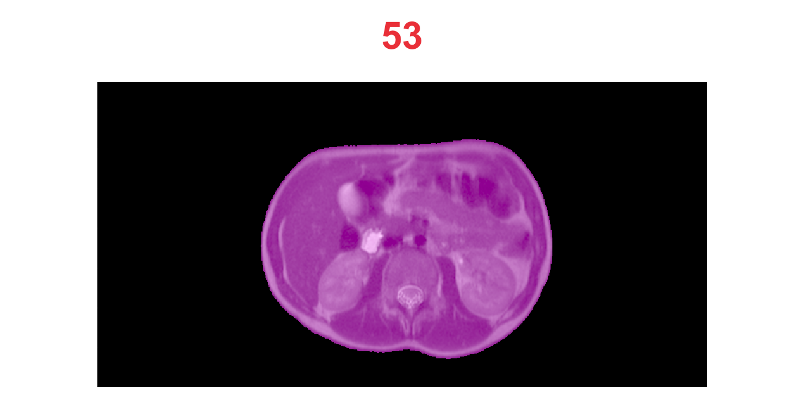
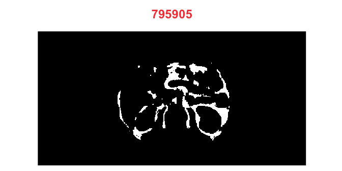
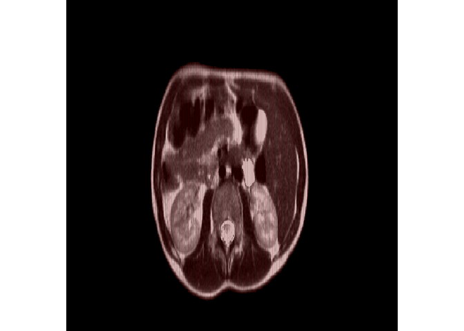

Convert Images to Tensors
================
19.11.2020

## Image data for U-Net

Source [2.2.11 Data representations for neural
networks](https://livebook.manning.com/book/deep-learning-with-r/chapter-2/48)
in [Deep Learning with
R](https://www.manning.com/books/deep-learning-with-r) by François
Chollet with J. J. Allaire.

Images typically have three dimensions:

    height × width × color channels

Although grayscale images have only a single color channel and could
thus be stored in 2D tensors, by convention image tensors are always 3D,
with a one-dimensional color channel for grayscale images.

A batch of 80 grayscale images of size 768×384 could thus be stored in a
tensor of shape

    (80, 768, 384, 1)

and a batch of 80 color images could be stored in a tensor of shape

    (80, 768, 384, 3)

and a batch of 80 mask –

    (80, 768, 384, 2)

## Important Note

We will crop all images to 768x384 and prepare additional data with
resampled (smaller) images: 384x192 and 192x96. Note that both
dimensions 768x384 are divisble by 128 (768/2^7=6, 384/2^7=3).

## Helper functions

``` r
crop_image_wxhx1 <- function(img, ll = c(0, 0), wh = c(768, 384)) {
  ll = c(ll, 1)
  # c(34, 56, 1)
  ur = ll + c(wh, 0) - c(1, 1, 0)
  # c(768 - 1, 384 - 1, 0)
  ANTsRCore::cropIndices(img, ll, ur)
}
```

``` r
get_channel <- function(img, channel = 1) {
  ANTsRCore::splitChannels(img)[[channel]]
}
```

``` r
imageList2sliceList <- function(
    iList,
    channel = 1,
    z_slice = 1,
    do_cropping = TRUE,
    lower_left = c(34, 56), 
    width_x_height = c(768, 384)
) {
  if (do_cropping == TRUE) {
    iList <- purrr::map(
      iList,
      crop_image_wxhx1, ll = lower_left, wh = width_x_height
    )
  }
  iList <- purrr::map(iList, get_channel, ch = channel)
  iList <- purrr::map(
    iList, 
    ANTsRCore::extractSlice, slice = z_slice, direction = 3
  ) 
}
```

``` r
imageList2MaskList <- function(iList, clean_up = 2) {
  purrr::map(iList, ANTsRCore::getMask, cleanup = clean_up)
}
```

## Read Images Info

``` r
info <- images_info("../80_images", extension = "dcm")
```

``` r
info_mri <- info %>% filter(kind == "MRI")
info_mri
#> # A tibble: 80 x 5
#>    patient    kind  type     series   file_path                                 
#>    <chr>      <chr> <chr>    <chr>    <chr>                                     
#>  1 1018642    MRI   image_b… ../80_i… ../80_images/1018642/image_base/1.2.840.1…
#>  2 1023660    MRI   image_b… ../80_i… ../80_images/1023660/image_base/1.2.840.1…
#>  3 1040979    MRI   image_b… ../80_i… ../80_images/1040979/image_base/1.2.840.1…
#>  4 1041204    MRI   image_b… ../80_i… ../80_images/1041204/image_base/1.2.840.1…
#>  5 1095912    MRI   image_b… ../80_i… ../80_images/1095912/image_base/1.2.840.1…
#>  6 1110505-2… MRI   image_b… ../80_i… ../80_images/1110505-2011/image_base/1.2.…
#>  7 1110505-2… MRI   image_b… ../80_i… ../80_images/1110505-2012/image_base/1.2.…
#>  8 1176610    MRI   image_b… ../80_i… ../80_images/1176610/image_base/1.2.840.1…
#>  9 1185364    MRI   image_b… ../80_i… ../80_images/1185364/image_base/1.2.840.1…
#> 10 158894-20… MRI   image_b… ../80_i… ../80_images/158894-2016/image_base/1.2.8…
#> # … with 70 more rows
```

``` r
info_scat <- info %>% filter(kind == "SCAT")
info_scat
#> # A tibble: 80 x 5
#>    patient    kind  type    series    file_path                                 
#>    <chr>      <chr> <chr>   <chr>     <chr>                                     
#>  1 1018642    SCAT  dicom_… ../80_im… ../80_images/1018642/dicom_red/1.2.840.19…
#>  2 1023660    SCAT  dicom_… ../80_im… ../80_images/1023660/dicom_red/1.2.840.19…
#>  3 1040979    SCAT  dicom_… ../80_im… ../80_images/1040979/dicom_red/1.2.840.19…
#>  4 1041204    SCAT  dicom_… ../80_im… ../80_images/1041204/dicom_red/1.2.840.19…
#>  5 1095912    SCAT  dicom_… ../80_im… ../80_images/1095912/dicom_red/1.2.840.19…
#>  6 1110505-2… SCAT  dicom_… ../80_im… ../80_images/1110505-2011/dicom_red/1.2.8…
#>  7 1110505-2… SCAT  dicom_… ../80_im… ../80_images/1110505-2012/dicom_red/1.2.8…
#>  8 1176610    SCAT  dicom_… ../80_im… ../80_images/1176610/dicom_red/1.2.840.19…
#>  9 1185364    SCAT  dicom_… ../80_im… ../80_images/1185364/dicom_red/1.2.840.19…
#> 10 158894-20… SCAT  dicom_… ../80_im… ../80_images/158894-2016/dicom_red/1.2.84…
#> # … with 70 more rows
```

``` r
info_vsat <- info %>% filter(kind == "VSAT")
info_vsat
#> # A tibble: 80 x 5
#>    patient    kind  type     series   file_path                                 
#>    <chr>      <chr> <chr>    <chr>    <chr>                                     
#>  1 1018642    VSAT  dicom_b… ../80_i… ../80_images/1018642/dicom_blue/1.2.840.1…
#>  2 1023660    VSAT  dicom_b… ../80_i… ../80_images/1023660/dicom_blue/1.2.840.1…
#>  3 1040979    VSAT  dicom_b… ../80_i… ../80_images/1040979/dicom_blue/1.2.840.1…
#>  4 1041204    VSAT  dicom_b… ../80_i… ../80_images/1041204/dicom_blue/1.2.840.1…
#>  5 1095912    VSAT  dicom_b… ../80_i… ../80_images/1095912/dicom_blue/1.2.840.1…
#>  6 1110505-2… VSAT  dicom_b… ../80_i… ../80_images/1110505-2011/dicom_blue/1.2.…
#>  7 1110505-2… VSAT  dicom_b… ../80_i… ../80_images/1110505-2012/dicom_blue/1.2.…
#>  8 1176610    VSAT  dicom_b… ../80_i… ../80_images/1176610/dicom_blue/1.2.840.1…
#>  9 1185364    VSAT  dicom_b… ../80_i… ../80_images/1185364/dicom_blue/1.2.840.1…
#> 10 158894-20… VSAT  dicom_b… ../80_i… ../80_images/158894-2016/dicom_blue/1.2.8…
#> # … with 70 more rows
```

## Create Images and Mask Lists

``` r
mri_list  <- imageFileNames2ImageList(info_mri[["file_path"]]) %>%
  imageList2sliceList(channel = 1)
mask_list <- imageList2MaskList(mri_list, clean_up = 2)

scat_list <- imageFileNames2ImageList(info_scat[["file_path"]]) %>%
  imageList2sliceList(channel = 1) %>%
  imageList2MaskList(clean_up = 0)

vsat_list <- imageFileNames2ImageList(info_vsat[["file_path"]]) %>%
  imageList2sliceList(channel = 3) %>%
  imageList2MaskList(clean_up = 0)
```

``` r
testthat::expect_equal(length(mri_list), 80)
testthat::expect_equal(length(mask_list), 80)
testthat::expect_equal(length(scat_list), 80)
testthat::expect_equal(length(vsat_list), 80)
```

``` r
dims <- purrr::map(mri_list, dim)
testthat::expect_setequal(dims[1], dims)
testthat::expect_setequal(dims[1], purrr::map(mask_list, dim))
testthat::expect_setequal(dims[1], purrr::map(scat_list, dim))
testthat::expect_setequal(dims[1], purrr::map(vsat_list, dim))
```

``` r
n <- 53
is_na <- purrr::compose(is.na, as.numeric)
testthat::expect_setequal(is_na(mri_list[[n]]), FALSE)
testthat::expect_setequal(is_na(mask_list[[n]]), FALSE)
testthat::expect_setequal(is_na(scat_list[[n]]), FALSE)
testthat::expect_setequal(is_na(vsat_list[[n]]), FALSE)
```

``` r
in_range <- function(img, rng = 0:255) all(unique(img) %in% rng)

testthat::expect_setequal(
  purrr::map(mri_list, in_range, rng = 0:255), TRUE
)
testthat::expect_setequal(
  purrr::map(mask_list, in_range, rng = 0:1), TRUE
)
testthat::expect_setequal(
  purrr::map(scat_list, in_range, rng = 0:1), TRUE
)
testthat::expect_setequal(
  purrr::map(vsat_list, in_range, rng = 0:1), TRUE
)
```

## [Alpha blending](https://en.wikipedia.org/wiki/Alpha_compositing#Alpha_blending_)

If the destination background is opaque, ${\\rm image}\_\\alpha = 1$:
$$
{\\rm blended\\ image}\_{\\rm RGB} = 
   (1 - \\alpha)\\cdot {\\rm image}\_{\\rm RGB} + 
      \\alpha\\cdot {\\rm mask}\_{\\rm RGB}
$$

``` r
image_RGB <- colorspace::RGB(R = ich1, G = ich2, B = ich3)
mask_RGB <- colorspace::RGB(R = mch1, G = mch2, B = mch3)

blended_RGB <- colorspace::mixcolor(alpha, image_RGB, mask_RGB)
blended_hex <- colorspace::hex(blended_RGB)
```

### Example of blending antsImages

-   `alpha == 0` – transparent mask
-   `alpha == 1` – opaque mask

``` r
i = 53
alpha = 0.25

mri <- antsImageClone(mri_list[[i]])
mask <- antsImageClone(mask_list[[i]])
scat <- antsImageClone(scat_list[[i]])
vsat <- antsImageClone(vsat_list[[i]])

mri <- mri * mask
scat <- scat * mask
vsat <- vsat * mask
```

``` r
plotBlendedImages(mri, mask)
plotBlendedImages(mri, scat)
plotBlendedImages(mri, vsat)
```



# Images Lists to Tensors

``` r
imageList2arrayList <- function(iList) {
  purrr::map(iList, as.array)
}
```

``` r
mask_alist <- imageList2arrayList(mask_list)
mri_alist <- imageList2arrayList(mri_list)
scat_alist <- imageList2arrayList(scat_list)
vsat_alist <- imageList2arrayList(vsat_list)
```

``` r
class(mri_alist[[53]])
#> [1] "matrix" "array"
```

``` r
arrayList2Tensor <- function(aList, dim_names = info_mri$patient) {
  n_images <- length(aList)
  dims = dim(aList[[1]])

  y_train <- array(
    data = NA,
    dim = c(n_images, dims)
  )

  for (i in seq_along(aList)) {
    y_train[i,,] <- aList[[i]]
  }

  dimnames(y_train)[[1]] <- dim_names

  y_train
}
```

``` r
mri_train <- arrayList2Tensor(mri_alist)
str(mri_train)
#>  num [1:80, 1:768, 1:384] 0 0 0 0 0 0 0 0 0 0 ...
#>  - attr(*, "dimnames")=List of 3
#>   ..$ : chr [1:80] "1018642" "1023660" "1040979" "1041204" ...
#>   ..$ : NULL
#>   ..$ : NULL

mask_train <- arrayList2Tensor(mask_alist)

# mask_train[mask_train == 0] <- NA
# mri_train <- mri_train * mask_train
```

``` r
scat_train <- arrayList2Tensor(scat_alist)
# scat_train <- scat_train * mask_train
```

``` r
vsat_train <- arrayList2Tensor(vsat_alist)
# vsat_train <- vsat_train * mask_train
```

### Check if dimnames are parallel to image indexes

``` r
plot_array2d(mri_train[5,,], title = dimnames(mri_train)[[1]][[5]])
plot_array2d(mri_train[29,,], title = dimnames(mri_train)[[1]][[29]])
```


``` r
plot_array2d(scat_train[46,,], title = dimnames(scat_train)[[1]][[46]])
plot_array2d(scat_train["700120",,], title = dimnames(scat_train)[[1]][[46]])
```


``` r
plot_array2d(vsat_train[51,,], title = dimnames(vsat_train)[[1]][[51]])
plot_array2d(vsat_train[53,,], title = dimnames(vsat_train)[[1]][[53]])
```



``` r
dim(vsat_train[53,,])
#> [1] 768 384
table(vsat_train[53,,])
#> 
#>      0      1 
#> 284002  10910
```

Possible BUG:  
Removed 211608 rows containing missing values (geom\_raster).

``` r
# plot_array2d(vsat_train[53,,])
plot_array2d(vsat_train[53,,] * mask_train[53,,])
```


``` r
table(as.numeric(mask_train[53,,]), exclude = NULL)
#> 
#>      0      1 
#> 211608  83304
```

``` r
prod(dim(mask_train[53,,]))
#> [1] 294912
83304+211608
#> [1] 294912
```

``` r
mask53 <- getMask(mri_list[[53]])
invisible(plot(mri_list[[53]], mask53, alpha = 0.4, doCropping = FALSE))
```


``` r
range(mask53)
#> [1] 0 1
```

``` r
plot_array2d(mri_train[53,,])
```



``` r
dims <- dim(vsat_train[53,,])

vec <- as.numeric(vsat_train[53,,])
length(vec[is.nan(vec)])
#> [1] 0
vec[is.nan(vec)] <- 0
range(vec)
#> [1] 0 1

vsat_train[53,,] <- array(vec, dim = dims) 
maxi = max(vsat_train[53,,], na.rm = TRUE)
maxi
#> [1] 1

plot_array2d(vsat_train[53,,])
```


``` r
# plot_array2d(vsat_train[54,,])
# plot_array2d(vsat_train[59,,])

# vsat[53,,][is.nan(vsat[53,,])] <- NA
# vsat[53,,] <- vsat[53,,] / maxi
# is.nan(maxi)
# is.na(maxi)
# maxi == 0
```

## Resampling Tensors

Use these functions `ANTsRNet::resampleTensor`,
`reticulate::array_reshape`.

## AdvR: missing values

``` r
NA > 5
#> [1] NA
NA > NA
#> [1] NA
10 * NA
#> [1] NA
!NA
#> [1] NA
```

``` r
NA | TRUE
#> [1] TRUE
NA & FALSE
#> [1] FALSE
```

``` r
0/0
#> [1] NaN
1/0
#> [1] Inf
-1/0
#> [1] -Inf
1/Inf
#> [1] 0
```

``` r
# x == NA
empty = c()
is.finite(empty)
#> logical(0)
empty[is.finite(empty)]
#> NULL
empty[is.na(empty)] 
#> NULL
maxi = max(empty[is.finite(empty)])
#> Warning in base::max(x, ..., na.rm = na.rm): no non-missing arguments to max;
#> returning -Inf
is.finite(maxi)
#> [1] FALSE
cat("---\n")
#> ---
x <- c(NA, 5, NA, 10)
is.na(x)
#> [1]  TRUE FALSE  TRUE FALSE
is.finite(x)
#> [1] FALSE  TRUE FALSE  TRUE
x[is.finite(x)]
#> [1]  5 10
x[!is.na(x)]
#> [1]  5 10
max(x[!is.na(x)])
#> [1] 10
y <- c(NaN, 5, NaN, 10)
is.na(y)
#> [1]  TRUE FALSE  TRUE FALSE
is.finite(y)
#> [1] FALSE  TRUE FALSE  TRUE
y[is.finite(y)]
#> [1]  5 10
y[!is.na(y)]
#> [1]  5 10
max(y[!is.na(y)])
#> [1] 10
z <- c(Inf, 5, -Inf, 10)
is.na(z)
#> [1] FALSE FALSE FALSE FALSE
is.finite(z)
#> [1] FALSE  TRUE FALSE  TRUE
z[is.finite(z)]
#> [1]  5 10
z[!is.na(z)]
#> [1]  Inf    5 -Inf   10
max(z[!is.na(z)])
#> [1] Inf
```

``` r
?max
#> Help on topic 'max' was found in the following packages:
#> 
#>   Package               Library
#>   ANTsRCore             /Users/wbzyl/Library/R/4.0/library
#>   base                  /Library/Frameworks/R.framework/Resources/library
#> 
#> 
#> Using the first match ...
max(c(1, -Inf))
#> [1] 1

max(c())
#> Warning in base::max(x, ..., na.rm = na.rm): no non-missing arguments to max;
#> returning -Inf
#> [1] -Inf
max(NA, na.rm = TRUE)
#> Warning in base::max(x, ..., na.rm = na.rm): no non-missing arguments to max;
#> returning -Inf
#> [1] -Inf
max(NaN, na.rm = TRUE)
#> Warning in base::max(x, ..., na.rm = na.rm): no non-missing arguments to max;
#> returning -Inf
#> [1] -Inf

maxi <- max(c())
#> Warning in base::max(x, ..., na.rm = na.rm): no non-missing arguments to max;
#> returning -Inf
!is.finite(maxi) | maxi == 0
#> [1] TRUE
maxi <- 0
!is.finite(maxi) | maxi == 0
#> [1] TRUE
```

## Looking thru colorspace

``` r
A = c(0.5, 1, 0, NA, NaN, Inf)
B = c(0.5, 1, 0, 0.5, 0.5, 0.5)
tb <- colorspace::RGB(R = A, G = B, B = B)
tb
#>        R   G   B
#> [1,] 0.5 0.5 0.5
#> [2,] 1.0 1.0 1.0
#> [3,] 0.0 0.0 0.0
#> [4,]  NA 0.5 0.5
#> [5,] NaN 0.5 0.5
#> [6,] Inf 0.5 0.5
```

``` r
col <- colorspace::hex(tb)
col
#> [1] "#BCBCBC" "#FFFFFF" "#000000" NA        NA        NA
is.na(col[1])
#> [1] FALSE
is.na(col[4])
#> [1] TRUE
```

``` r
ord <- as.character(levels(factor(col)))
ord
#> [1] "#000000" "#BCBCBC" "#FFFFFF"
ord[2]
#> [1] "#BCBCBC"
```

``` r
f <- factor(col)
f
#> [1] #BCBCBC #FFFFFF #000000 <NA>    <NA>    <NA>   
#> Levels: #000000 #BCBCBC #FFFFFF
levels(f)
#> [1] "#000000" "#BCBCBC" "#FFFFFF"
```
