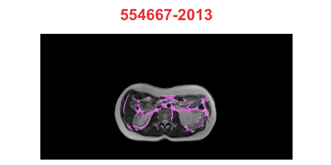

Convert Images to Tensors
================
17.11.2020

*NOTE:* Use these functions `ANTsRNet::resampleTensor`,
`reticulate::array_reshape`

## Image data for U-Net

Source [2.2.11 Data representations for neural
networks](https://livebook.manning.com/book/deep-learning-with-r/chapter-2/48)
in [Deep Learning with
R](https://www.manning.com/books/deep-learning-with-r) by François
Chollet with J. J. Allaire.

Images typically have three dimensions:

    height × width × color channels

Although grayscale images have only a single color channel and could
thus be stored in 2D tensors, by convention image tensors are always 3D,
with a one-dimensional color channel for grayscale images.

A batch of 80 grayscale images of size 768×384 could thus be stored in a
tensor of shape

    (80, 768, 384, 1)

and a batch of 80 color images could be stored in a tensor of shape

    (80, 768, 384, 3)

and a batch of 80 mask –

    (80, 768, 384, 2)

## Important Note

We will crop all images to 768x384 and prepare additional data with
resampled (smaller) images: 384x192 and 192x96. Note that both
dimensions 768x384 are divisble by 128 (768/2^7=6, 384/2^7=3).

## Read Images Info

``` r
info <- images_info("../80_images", extension = "dcm")
info
#> # A tibble: 320 x 5
#>    patient kind  type      series    file_path                                  
#>    <chr>   <chr> <chr>     <chr>     <chr>                                      
#>  1 1018642 AT    dicom_co… ../80_im… ../80_images/1018642/dicom_color/1.2.840.1…
#>  2 1018642 MRI   image_ba… ../80_im… ../80_images/1018642/image_base/1.2.840.19…
#>  3 1018642 SCAT  dicom_red ../80_im… ../80_images/1018642/dicom_red/1.2.840.191…
#>  4 1018642 VSAT  dicom_bl… ../80_im… ../80_images/1018642/dicom_blue/1.2.840.19…
#>  5 1023660 AT    dicom_co… ../80_im… ../80_images/1023660/dicom_color/1.2.840.1…
#>  6 1023660 MRI   image_ba… ../80_im… ../80_images/1023660/image_base/1.2.840.19…
#>  7 1023660 SCAT  dicom_red ../80_im… ../80_images/1023660/dicom_red/1.2.840.191…
#>  8 1023660 VSAT  dicom_bl… ../80_im… ../80_images/1023660/dicom_blue/1.2.840.19…
#>  9 1040979 AT    dicom_co… ../80_im… ../80_images/1040979/dicom_color/1.2.840.1…
#> 10 1040979 MRI   image_ba… ../80_im… ../80_images/1040979/image_base/1.2.840.19…
#> # … with 310 more rows
```

``` r
info_mri <- info %>% filter(kind == "MRI")
info_mri
#> # A tibble: 58 x 5
#>    patient kind  type     series    file_path                                   
#>    <chr>   <chr> <chr>    <chr>     <chr>                                       
#>  1 1018642 MRI   image_b… ../80_im… ../80_images/1018642/image_base/1.2.840.191…
#>  2 1023660 MRI   image_b… ../80_im… ../80_images/1023660/image_base/1.2.840.191…
#>  3 1040979 MRI   image_b… ../80_im… ../80_images/1040979/image_base/1.2.840.191…
#>  4 1041204 MRI   image_b… ../80_im… ../80_images/1041204/image_base/1.2.840.191…
#>  5 1095912 MRI   image_b… ../80_im… ../80_images/1095912/image_base/1.2.840.191…
#>  6 1176610 MRI   image_b… ../80_im… ../80_images/1176610/image_base/1.2.840.191…
#>  7 1185364 MRI   image_b… ../80_im… ../80_images/1185364/image_base/1.2.840.191…
#>  8 163855  MRI   image_b… ../80_im… ../80_images/163855/image_base/1.2.840.1910…
#>  9 306001  MRI   image_b… ../80_im… ../80_images/306001/image_base/1.2.840.1910…
#> 10 306637  MRI   image_b… ../80_im… ../80_images/306637/image_base/1.2.840.1910…
#> # … with 48 more rows
```

``` r
crop_image_wxhx1 <- function(img, ll = c(34, 56), wh = c(768, 384)) {
  ll = c(ll, 1)                        # c(34, 56, 1)
  ur = ll + c(wh, 0) - c(1, 1, 0)      # c(768 - 1, 384 - 1, 0)
  ANTsRCore::cropIndices(img, ll, ur)
}

crop_image_wxh <- function(img, ll = c(34, 56), wh = c(768, 384)) {
  ur = ll + wh - c(1, 1)               # c(768 - 1, 384 - 1)
  ANTsRCore::cropIndices(img, ll, ur)
}
```

## MRI images

``` r
mri_unet <- function(info, kind = "mri", ll = c(34, 56), wh = c(768, 384), channel = 1) {
  crop_image_wxhx1 <- function(img, ll = ll, wh = wh) {
    ll = c(ll, 1)                        # c(34, 56, 1)
    ur = ll + c(wh, 0) - c(1, 1, 0)      # c(768 - 1, 384 - 1, 0)
    ANTsRCore::cropIndices(img, ll, ur)
  }
  
  ukind <- stringr::str_to_upper(kind)
  
  base_paths <- info %>% filter(kind == ukind)
  iList <- imageFileNames2ImageList(base_paths[["file_path"]])
  n_images <- length(iList)
  
  domainImage = ANTsRCore::makeImage(imagesize = wh, voxval = 0)
  dims = dim(domainImage)
  
  y_train <- array(
    data = NA, 
    dim = c(components(iList[[1]]), dims, n_images)
  )
  
  K <- keras::backend()
  array_crop <- purrr::compose(as.array, crop_image_wxhx1)
  aList <- map(iList, array_crop, ll = ll, wh = wh)
  
  for (i in seq_along(aList)) {
    y_train[,,,i] <- aList[[i]]
  }
  
  y_train <- as.array(
    K$permute_dimensions(y_train, pattern = c(3L, 1L, 2L, 0L))
  )
  dimnames(y_train)[[1]] <- base_paths$patient
  
  y_train[,,,channel]
}
```

``` r
images <- mri_unet(info, kind = "MRI")
str(images)
#>  num [1:58, 1:768, 1:384] 0 0 0 0 0 0 0 0 0 0 ...
#>  - attr(*, "dimnames")=List of 3
#>   ..$ : chr [1:58] "1018642" "1023660" "1040979" "1041204" ...
#>   ..$ : NULL
#>   ..$ : NULL
```

``` r
plot_array2d(images[5,,], title = dimnames(images)[[1]][[5]])
plot_array2d(images[29,,], title = dimnames(images)[[1]][[29]])
```



``` r
plot_array2d(images[46,,], title = dimnames(images)[[1]][[46]])
plot_array2d(images["700120",,], title = dimnames(images)[[1]][[46]])
```


## TODO

``` r
p <- info$file_path[[1]]
img <- ANTsRCore::antsImageRead(p)
channels <- ANTsRCore::splitChannels(img)
slice <- ANTsRCore::extractSlice(channels[[1]], 1, 3)
cslice <- crop_image_wxh(slice)
aslice = as.array(cslice)

dim(cslice)
#> [1] 768 384
dim(aslice)
#> [1] 768 384
```

``` r
plot_array2d(aslice)
invisible(plot(cslice, doCropping=F))
```


