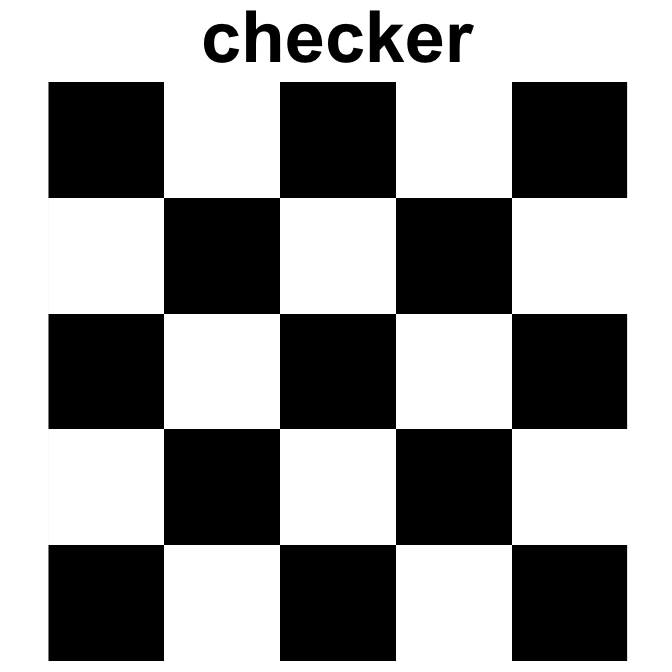
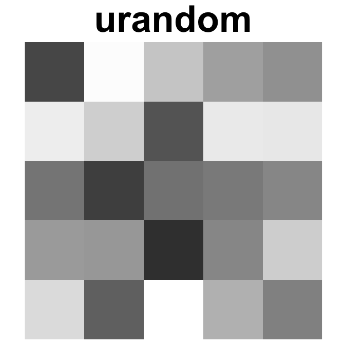
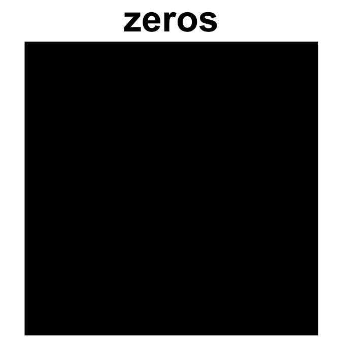
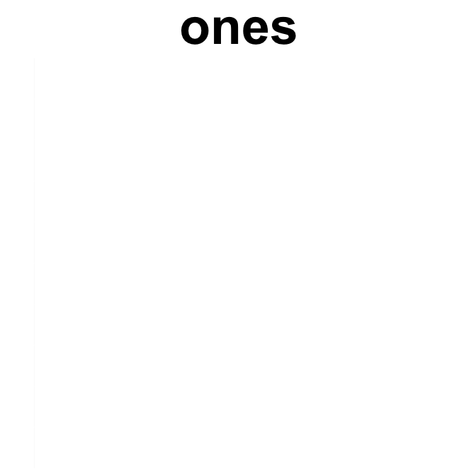

<!-- README.md is generated from README.Rmd. Please edit that file -->

# rraysplot

<!-- badges: start -->
<!-- badges: end -->

The goal of rraysplot is to make 2D arrays and matrices plots less
aggravating.

## Installation

You can install the released version of rraysplot from
[CRAN](https://CRAN.R-project.org) with:

``` r
install.packages("rraysplot")
```

You can install the development version of rraysplot from
[GitHub](https://github.com/) with:

``` r
# install.packages("devtools")
devtools::install_github("ventri2020/rraysplot")
```

## Example

This is a basic example which shows you how to solve a common problem:

``` r
library(rraysplot)
## basic example code
```

``` r
set.seed(202011)

lar <- make_arrays(m = 5, n = 5)
lar$checker
#>      [,1] [,2] [,3] [,4] [,5]
#> [1,]    0    1    0    1    0
#> [2,]    1    0    1    0    1
#> [3,]    0    1    0    1    0
#> [4,]    1    0    1    0    1
#> [5,]    0    1    0    1    0
lar$urandom
#>            [,1]      [,2]       [,3]       [,4]      [,5]
#> [1,] 0.09437554 0.8488876 0.23377674 0.38703741 0.7267632
#> [2,] 0.94736910 0.6544631 0.07468776 0.37722835 0.1633146
#> [3,] 0.60130009 0.1290866 0.22243508 0.04616133 0.9636635
#> [4,] 0.41073261 0.8151506 0.25459017 0.30399389 0.4945109
#> [5,] 0.34459253 0.8121503 0.30086852 0.64472934 0.2765490
```

``` r
plot_array2d(lar$checker, title = "checker")
plot_array2d(lar$urandom, title = "urandom")
plot_array2d(lar$zeros, title = "zeros")
plot_array2d(lar$ones, title = "ones")
plot_array2d(lar$rectangle, title = "square")
```


