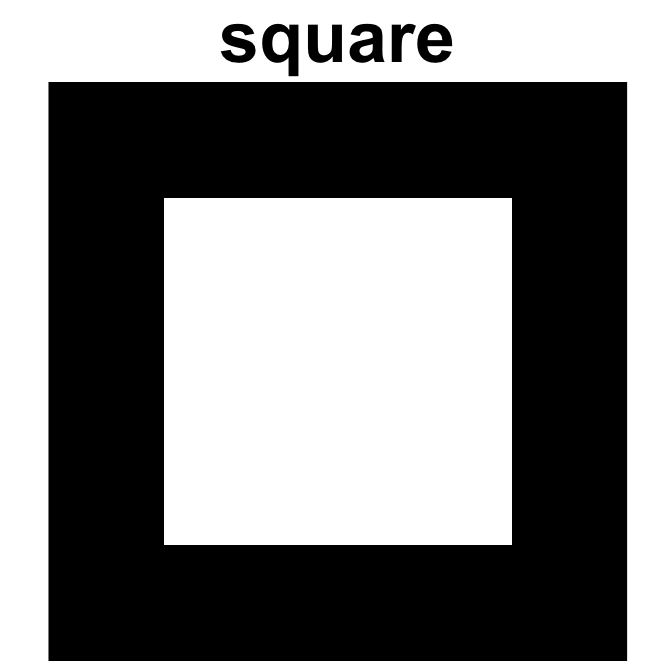

<!-- README.md is generated from README.Rmd. Please edit that file -->

# rraysplot

<!-- badges: start -->
<!-- badges: end -->

The goal of rraysplot is to make 2D arrays and matrices plots less
aggravating.

## Inserting Citations

[RStudio 1.4 Preview:
Citations](https://blog.rstudio.com/2020/11/09/rstudio-1-4-preview-citations/)

## Installation

You can install the development version of rraysplot from
[GitHub](https://github.com/) with:

``` r
# install.packages("devtools")
devtools::install_github("ventri2020/rraysplot")
```

## Example

This is a basic example which shows you how to solve a common problem:

``` r
library(rraysplot)

set.seed(202011)
c(ch5, r5, z5, o5, sq5) %<-% make_arrays(m = 5, n = 5)
```

``` r
plot_array2d(ch5, title = "checker", title_size = 54)
plot_array2d(r5,  title = "urandom", title_size = 54)
plot_array2d(z5,  title = "zeros", title_size = 54)
plot_array2d(o5,  title = "ones", title_size = 54)
plot_array2d(sq5, title = "square", title_size = 54)
```



``` r
plot_array2d(list(ch5, sq5))
plot_array2d(list(ch5, o5, sq5))
plot_array2d(list(ch5, r5, z5))

d5 = z5
d5[1, 1] = 1
d5[3, 3] = 0.75
d5[5, 5] = 0.5

plot_array2d(list(ch5, d5, d5))
plot_array2d(list(ch5, o5, d5))
```


Note that the `mm` values are rescaled to (0,1) range by the
`bhistogram` function.

``` r
mm = c(rnorm(1500, 0, .1), rnorm(1000, 1, .2))
bhistogram(mm, title = "Multimodal frequencies", title_size = 16)
```


